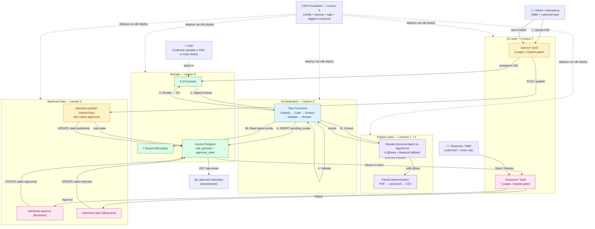
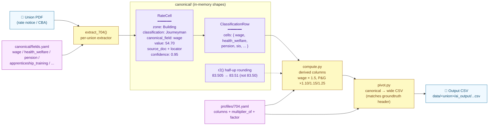
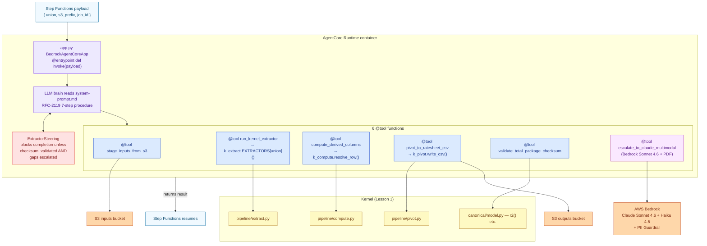
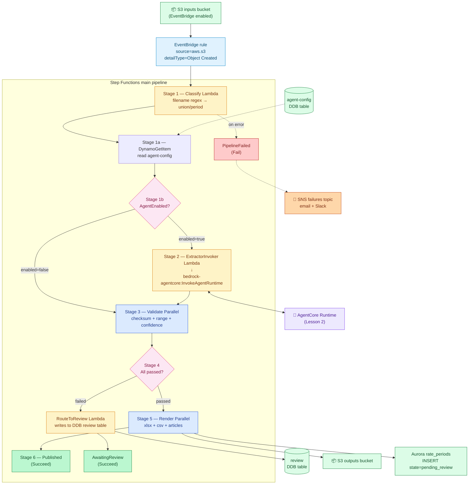
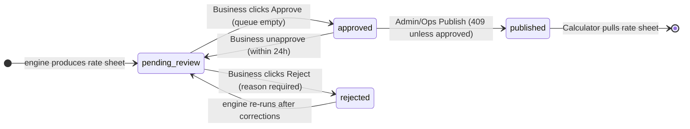
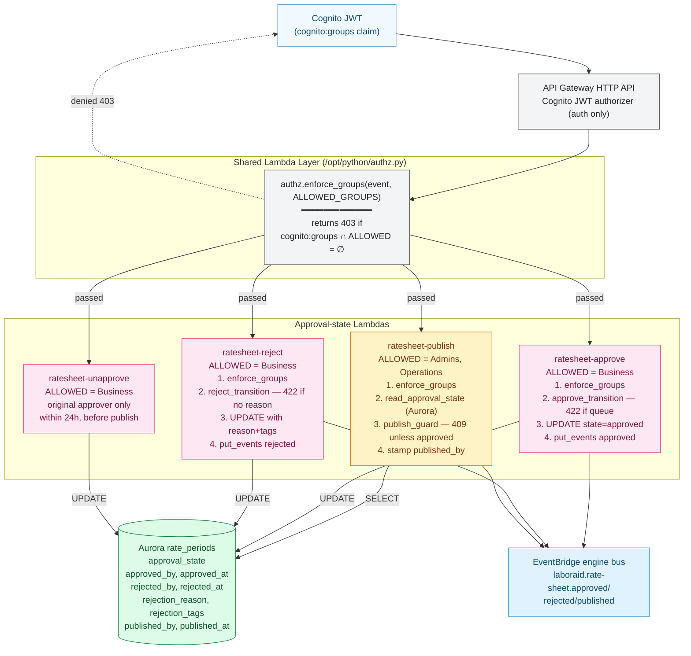
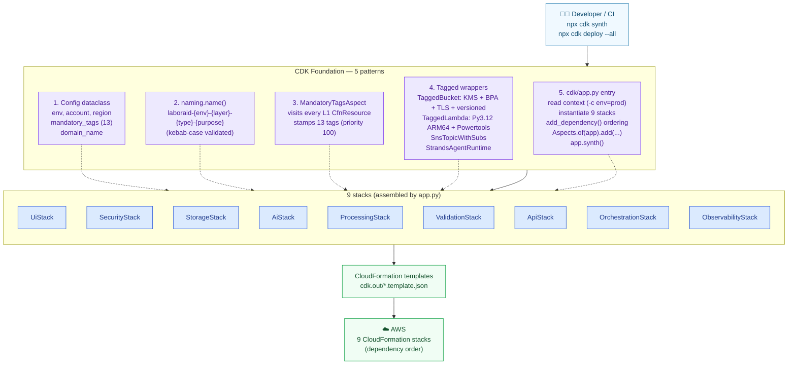
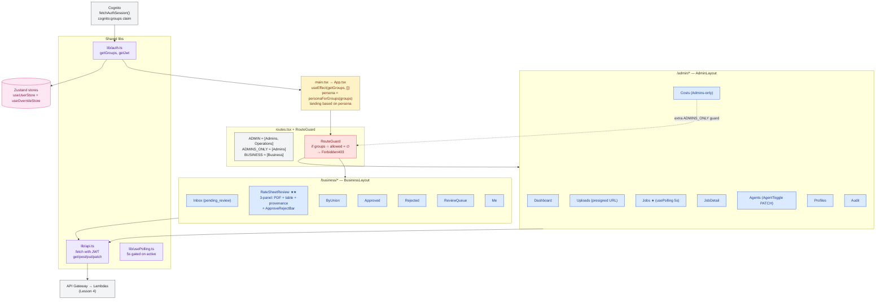
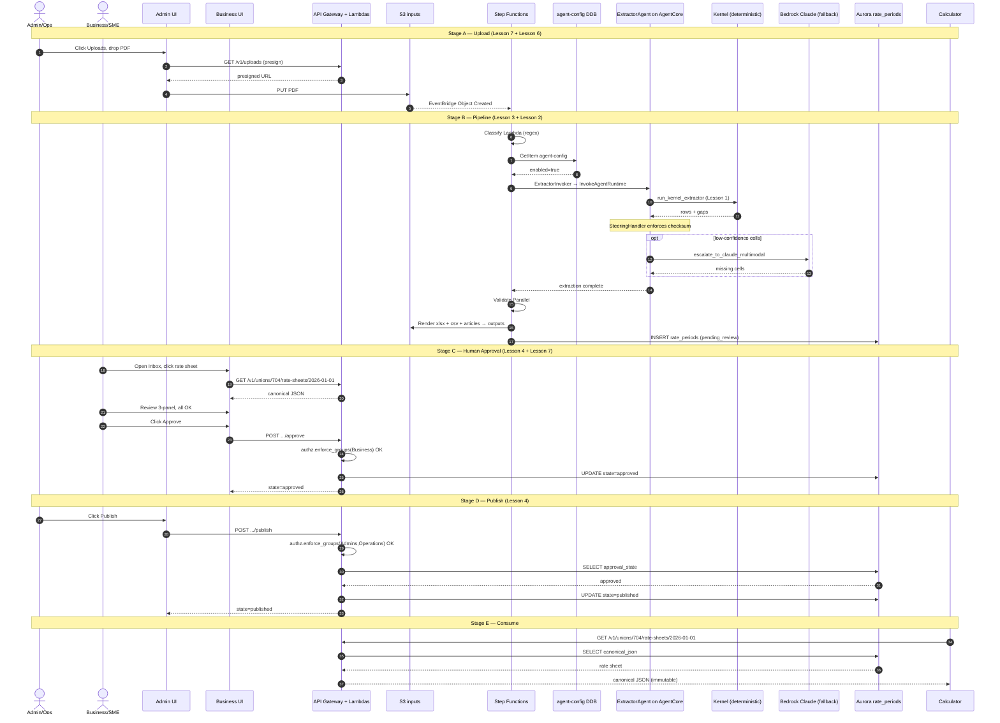

# End-to-End Architecture Flow

Visual companion to [`Learning_Lessons.md`](Learning_Lessons.md). One master end-to-end diagram, then per-lesson zoom-ins.

> **Two ways to view this:**
> - **GitHub** (this file) — Mermaid blocks render inline on github.com (this is the version with the syntax fixes that don't break the renderer)
> - **Browser SPA** ([`Architecture_Flow.html`](Architecture_Flow.html)) — open locally for the same diagrams with sticky nav + color-coded sections + sequence chart

Sections: [§0 Master](#0--the-whole-system-in-one-diagram) · [§1 Canonical (L1)](#1--lesson-1-zoom-in-the-canonical-layer) · [§2 Strands Agent (L2)](#2--lesson-2-zoom-in-the-strands-agent-on-agentcore) · [§3 Step Functions (L3)](#3--lesson-3-zoom-in-the-step-functions-orchestration) · [§4 Approval Gate (L4)](#4--lesson-4-zoom-in-the-human-approval-gate) · [§5 CDK Foundation (L5)](#5--lesson-5-zoom-in-the-cdk-foundation) · [§6 Storage Stack (L6)](#6--lesson-6-zoom-in-the-storage-stack) · [§7 React UI (L7)](#7--lesson-7-zoom-in-the-react-ui) · [§8 Full Sequence](#8--the-full-wire-end-to-end-sequence-diagram) · [Cheat sheet](#per-lesson-mapping-cheat-sheet)

---

## §0 — The whole system in one diagram

### Read the diagram with the lesson lens

| Block | Lesson | What it teaches |
|---|---|---|
| Engine Layer (Kernel + Agent) | 1 + 2 | PDF → canonical → CSV; agent wraps kernel as @tools |
| Orchestration Layer (Step Functions) | 3 | Who triggers what; the 6 stages; the agent enable/disable gate |
| Approval Gate (Lambdas + Aurora state) | 4 | publish 409 guard + Business approve/reject + audit trail |
| CDK Foundation (cross-cutting) | 5 | Patterns every stack reuses |
| Storage Layer | 6 | One concrete stack showing every pattern |
| UI Layer (two personas) | 7 | Where humans interact; how button clicks map to Lambdas |

---

## §1 — Lesson 1 zoom-in: The Canonical Layer

**Where it fits:** inside the "Engine Layer" block. The canonical layer is the in-memory shape the kernel and agent both operate on.

> **Key takeaway:** three vocabularies — PDF native ("Wage", "H&W"), canonical internal (`wage`, `health_welfare`), output CSV header. RateCell carries provenance so every output value is auditable.

---

## §2 — Lesson 2 zoom-in: The Strands Agent on AgentCore

**Where it fits:** inside the "Engine Layer" block, on top of the kernel. The agent is what makes the kernel callable from AWS.

> **Key takeaway:** 5 of 6 tools just call the deterministic kernel. Only `escalate_to_claude_multimodal` hits an LLM, and only when the kernel can't read a cell. The SteeringHandler prevents the LLM brain from claiming "done" prematurely.

---

## §3 — Lesson 3 zoom-in: The Step Functions Orchestration

**Where it fits:** the "Orchestration Layer" block. The conductor that ties everything together.

> **Key takeaway:** every Lambda has automatic retries (3× exp backoff). Choice states are where human-meaningful decisions live — the admin's enable/disable toggle, the validators' verdict. Low-confidence cells go to the review queue; pipeline failures go to SNS + ops.

---

## §4 — Lesson 4 zoom-in: The Human Approval Gate

**Where it fits:** the "Approval Gate" block — between "rate sheet produced" and "rate sheet consumed by Calculator."

### Approval state machine

### The 4 endpoints + shared authz layer

> **Key takeaway:** the 409 guard reads from Aurora (not request body — audit fix **B1**). Approve writes to Aurora AND fires EventBridge (audit fix **B2**). Every gated Lambda checks Cognito groups via the shared layer (audit fix **B3**).

---

## §5 — Lesson 5 zoom-in: The CDK Foundation

**Where it fits:** the dashed CDK Foundation block. Doesn't run at runtime — it's how everything else gets *described* and *deployed*.

> **Key takeaway:** 5 patterns + 1 entry file = 9 stacks. Adding a 10th stack is the same recipe: Config in, name() everywhere, TaggedBucket/Lambda for resources, register in app.py, MandatoryTagsAspect tags everything.

---

## §6 — Lesson 6 zoom-in: The Storage Stack

**Where it fits:** the "Storage Layer" block. Every other stack depends on this one.

```mermaid
flowchart TB
    Sec["SecurityStack<br/>provides master_key KMS CMK"]

    subgraph Storage["StorageStack"]
        direction TB

        subgraph S3B["6 S3 buckets — TaggedBucket: KMS + BPA + TLS + versioned"]
            direction LR
            B0["audit<br/>(server-access-log target)"]
            B1["inputs ★<br/>EventBridge=ON<br/>fires SFN<br/>archive lifecycle"]
            B2["processed<br/>90-day expiry"]
            B3["outputs<br/>archive lifecycle<br/>Object Lock (prod)"]
            B4["profiles<br/>(ops-managed)"]
            B5["cba-corpus<br/>(KB deferred)"]
        end

        subgraph DDBT["7 DynamoDB tables — PAY_PER_REQUEST + KMS + PITR"]
            direction LR
            T1["files<br/>tenant#union / period#filename<br/>📡 stream"]
            T2["jobs<br/>job_id<br/>📡 stream"]
            T3["review<br/>tenant / created_at#cell_id"]
            T4["overrides"]
            T5["cadence"]
            T6["idempotency (TTL 24h)"]
            T7["agent-config ★<br/>(admin toggle)"]
        end

        subgraph AuroraB["Aurora Serverless v2"]
            direction TB
            Net["Minimal VPC<br/>max_azs=2, nat_gateways=0<br/>PRIVATE_ISOLATED"]
            DB[("Aurora cluster<br/>0.5-2 ACU autoscale<br/>enable_data_api=TRUE<br/>unions, rate_periods,<br/>rate_cells, audit_log")]
            SI["SchemaInitFn (Custom Resource)<br/>runs schema.sql via RDS Data API<br/>idempotent (IF NOT EXISTS)"]
            Sm[("Secrets Manager<br/>laboraid-{env}-l3-secret-aurora")]
            DB --- Sm
            DB --- Net
            SI --> DB
        end
    end

    DownStacks["Downstream stacks<br/>(Processing, API, Orchestration, ...)"]
    SFN["Step Functions<br/>(Lesson 3)"]
    Lambdas["Lesson 4 Lambdas<br/>(publish/approve/reject)"]

    Sec --> Storage
    Storage --> DownStacks
    B1 -->|EventBridge ObjectCreated| SFN
    T7 -->|DynamoGetItem in SFN| SFN
    DB -->|Data API HTTPS| Lambdas

    classDef ext fill:#f3f4f6,stroke:#525252,color:#262626
    classDef audit fill:#fef3c7,stroke:#d97706,color:#78350f
    classDef inb fill:#dbeafe,stroke:#1d4ed8,color:#1e3a8a
    classDef inter fill:#fef9c3,stroke:#a16207,color:#713f12
    classDef outb fill:#f0fdf4,stroke:#16a34a,color:#14532d
    classDef cfg fill:#fae8ff,stroke:#a21caf,color:#581c87
    classDef def fill:#e5e7eb,stroke:#6b7280,color:#374151
    classDef ddb fill:#dcfce7,stroke:#15803d,color:#14532d
    classDef strm fill:#86efac,stroke:#15803d,color:#14532d
    classDef net fill:#e0f2fe,stroke:#0284c7,color:#0c4a6e
    classDef au fill:#fce7f3,stroke:#db2777,color:#831843
    classDef cr fill:#ede9fe,stroke:#7c3aed,color:#4c1d95
    classDef sm fill:#fee2e2,stroke:#dc2626,color:#7f1d1d

    class Sec,DownStacks,SFN,Lambdas ext
    class B0 audit
    class B1 inb
    class B2 inter
    class B3 outb
    class B4 cfg
    class B5 def
    class T1,T2 strm
    class T3,T4,T5,T6,T7 ddb
    class Net net
    class DB au
    class SI cr
    class Sm sm
```

★ = referenced by name from the master flow. The `inputs` bucket fires SFN; the `agent-config` table powers the admin toggle.

> **Key takeaway:** Aurora lives in an isolated VPC (no NAT, no internet). Lambdas reach it via the RDS Data API over HTTPS — no VPC attachment needed. Schema is applied automatically by a CloudFormation custom resource on every deploy.

---

## §7 — Lesson 7 zoom-in: The React UI

**Where it fits:** the "UI Layer" block. Two personas, one Vite build, gated by Cognito groups.

★ Jobs is the canonical CRUD pattern. ★★ RateSheetReview is the most complex page — its ApproveRejectBar is the line-by-line UI client for Lesson 4's approve/reject Lambdas.

> **Key takeaway:** the UI is the rendered version of the API. Every button click maps to one Lambda. There's no UI-only logic — defense in depth (UI disables buttons + Lambda returns 4xx), but the source of truth is always the Lambda.

---

## §8 — The full wire: end-to-end sequence diagram

This is the master flow as a time-ordered sequence chart — actor by actor, message by message, across all five stages.

---

## Per-lesson mapping (cheat sheet)

When you're looking at the master flow and asking "where does X come from?", use this:

| Block in §0 master flow | Lesson | What to open in repo |
|---|---|---|
| PDF upload via Admin UI | 7 (Pattern 4) | `ui/src/admin/Uploads.tsx` + `lib/api.ts` |
| S3 → EventBridge → SFN | 3 (Part 1) | `cdk/laboraid_cdk/stacks/orchestration_stack.py` |
| Classify Lambda | 3 (Stage 1) | `lambdas/processing/classifier/handler.py` |
| Agent enable/disable toggle | 3 (Stage 1a/1b) + 4 (agent-toggle) | `agent-config` DDB + Choice state in `sfn/main_pipeline.py` |
| Strands ExtractorAgent | 2 | `agents/extractor/agent.py` + `steering.py` + `system-prompt.md` |
| Kernel deterministic extraction | 1 + 2 | `kernel/pipeline/{extract,compute,pivot}.py` |
| Validators (3 parallel) | 3 (Stage 3) | `lambdas/validation/{checksum,range,confidence}/handler.py` |
| Render (3 parallel) | 3 (Stage 5) | `lambdas/rendering/{xlsx,csv,articles}-renderer/handler.py` |
| Review queue write | 3 (review path) | `lambdas/validation/review-router/handler.py` |
| Aurora `rate_periods` schema | 4 (Part 7) + 6 (Part 4) | `cdk/assets/schema_init/schema.sql` |
| Business Approve/Reject | 4 + 7 | `ratesheet-{approve,reject}/handler.py` + `ApproveRejectBar.tsx` |
| Publish 409 gate | 4 (Part 2) | `ratesheet-publish/handler.py` |
| Cognito group checks | 4 (Part 1) + 7 (Pattern 2) | `lambdas/api/_shared/python/authz.py` + `RouteGuard.tsx` |
| Calculator consumes published | 4 (state machine) | GET ratesheet Lambda + Aurora SELECT |
| All resources tagged + named | 5 | `cdk/laboraid_cdk/{util/naming,aspects/mandatory_tags,config}.py` |
| Stack composition + deploy order | 5 (Pattern 5) | `cdk/app.py` |

---

## Where to go next

- For depth on any lesson block → [`Learning_Lessons.md`](Learning_Lessons.md)
- For the read-order roadmap → [`Understanding.md`](Understanding.md)
- For the original spec → [`09_Technical_Implementation_Spec.md`](09_Technical_Implementation_Spec.md)
- For the management view → [`CTO_SUMMARY.md`](CTO_SUMMARY.md)
- For audit receipts → [`AUDIT_REPORT.md`](AUDIT_REPORT.md) + [`AUDIT_VERIFICATION.md`](AUDIT_VERIFICATION.md)
- For the same diagrams in a self-contained browser SPA → [`Architecture_Flow.html`](Architecture_Flow.html)
