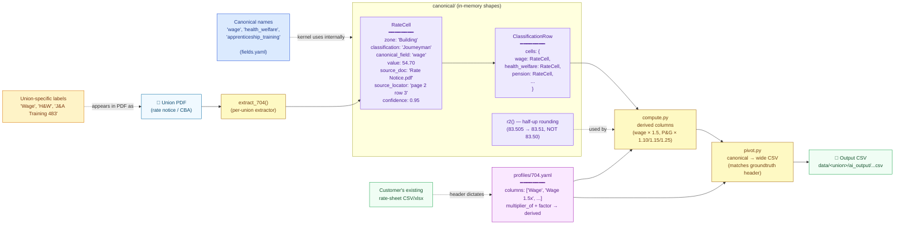
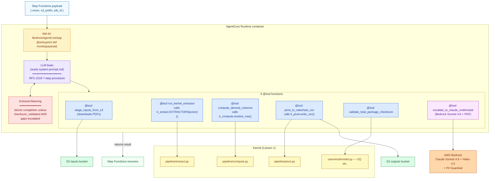
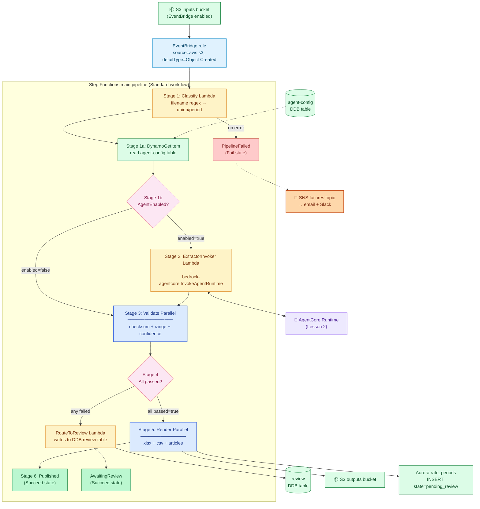
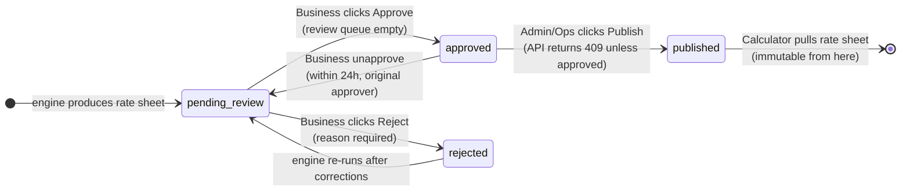
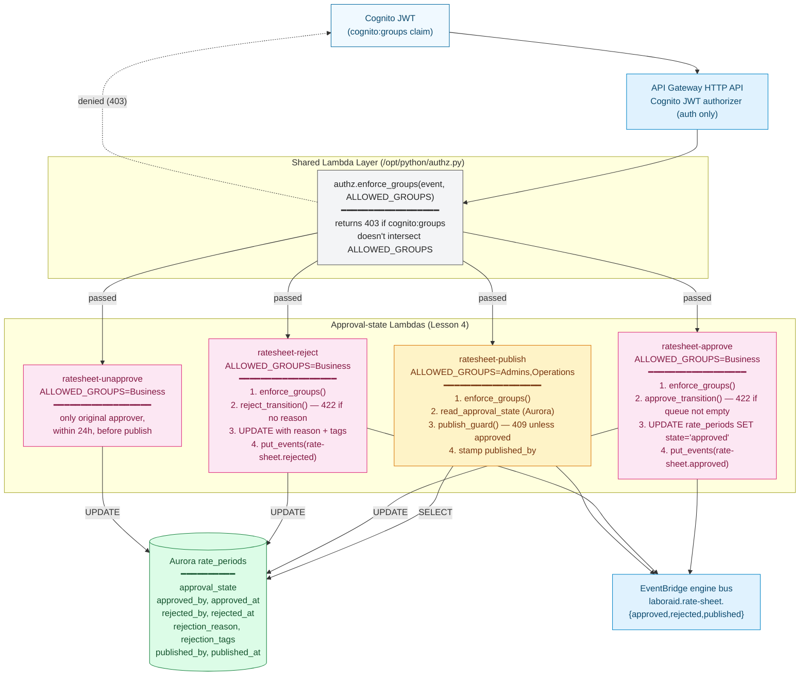
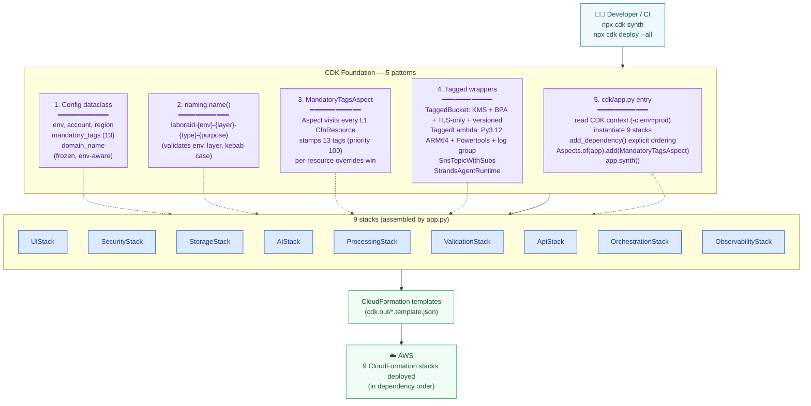
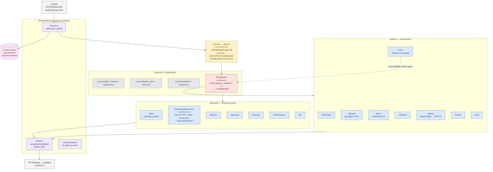
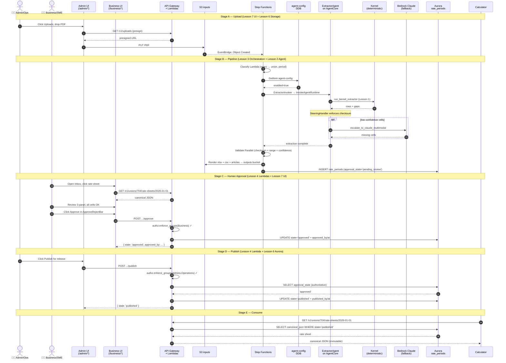

# End-to-End Architecture Flow

This document is the visual companion to [`Learning_Lessons.md`](Learning_Lessons.md). Each lesson maps to one or more blocks in the master flow below; the per-lesson diagrams zoom into each block. Read top-down: master picture first, then drill into each lesson's slice.

All diagrams are Mermaid — they render inline on GitHub.

---

## §0 — The whole system in one diagram

```mermaid
flowchart TB
    PDF["📄 PDF<br/>Customer uploads a CBA or Rate Notice"]:::input
    Admin["👨‍💼 Admin / Operations<br/>(NBS + LaborAid ops)"]:::adminActor
    Business["👩‍💼 Business / SME<br/>(LaborAid + Union rep)"]:::businessActor
    Calc["📊 LaborAid Calculator<br/>(downstream)"]:::output

    subgraph UI["UI Layer — Lesson 7"]
        AdminUI["/admin/* shell<br/>8 pages, Cognito gated"]:::adminBlock
        BusinessUI["/business/* shell<br/>7 pages, Cognito gated"]:::businessBlock
    end

    subgraph Engine["Engine Layer — Lessons 1 + 2"]
        Kernel["Kernel (deterministic)<br/>PDF → canonical → CSV<br/>~99.6% on known unions"]:::engineBlock
        Agent["Strands ExtractorAgent on AgentCore<br/>6 @tools wrapping kernel<br/>+ Bedrock fallback"]:::engineBlock
    end

    subgraph Orchestration["Orchestration Layer — Lesson 3"]
        SFN["Step Functions main pipeline<br/>Classify → Gate → Extract → Validate → Render"]:::orchBlock
    end

    subgraph Storage["Storage Layer — Lesson 6"]
        S3["6 S3 buckets<br/>(inputs / processed / outputs / etc.)"]:::storageBlock
        DDB["7 DynamoDB tables<br/>(files / jobs / review / agent-config / etc.)"]:::storageBlock
        Aurora["Aurora Postgres<br/>rate_periods + approval_state"]:::storageBlock
    end

    subgraph Approval["Approval Gate — Lesson 4"]
        Approve["ratesheet-approve<br/>(Business)"]:::businessBlock
        Reject["ratesheet-reject<br/>(Business)"]:::businessBlock
        Publish["ratesheet-publish<br/>(Admin/Ops) → 409 unless approved"]:::adminBlock
    end

    CDK["CDK Foundation — Lesson 5<br/>(Config + naming + tags Aspect + tagged constructs)"]:::foundationBlock

    %% --- The actual data flow ---
    Admin -- "1. Upload PDF" --> AdminUI
    AdminUI -- "presigned URL" --> S3
    PDF -. lands in .-> S3
    S3 -- "2. ObjectCreated event" --> SFN
    SFN -- "3a. Classify" --> SFN
    SFN -- "3b. Read agent-config" --> DDB
    SFN -- "3c. Extract (if enabled)" --> Agent
    Agent -- "calls @tool" --> Kernel
    Agent -- "Bedrock fallback (low confidence)" --> Engine
    Agent -- "results" --> SFN
    SFN -- "4. Validate (parallel)" --> SFN
    SFN -- "5. Render → S3" --> S3
    SFN -- "6. Insert with state=pending_review" --> Aurora

    Aurora -- "shows in Inbox" --> BusinessUI
    Business -- "Open / Review" --> BusinessUI
    BusinessUI -- "Approve" --> Approve
    BusinessUI -- "Reject + reason" --> Reject
    Approve -- "UPDATE state=approved" --> Aurora
    Reject -- "UPDATE state=rejected" --> Aurora

    Admin -- "click Publish (after approval)" --> AdminUI
    AdminUI -- "POST /publish" --> Publish
    Publish -- "read approval_state" --> Aurora
    Publish -- "if approved → UPDATE state=published" --> Aurora

    Aurora -- "GET rate-sheet (when published)" --> Calc

    CDK -. "deploys all of the above as<br/>9 CDK stacks via cdk deploy" .-> Orchestration
    CDK -. .-> Storage
    CDK -. .-> Approval
    CDK -. .-> Engine
    CDK -. .-> UI

    classDef input         fill:#f0f9ff,stroke:#0369a1,stroke-width:2px,color:#0c4a6e
    classDef output        fill:#f0fdf4,stroke:#16a34a,stroke-width:2px,color:#14532d
    classDef adminActor    fill:#fef3c7,stroke:#d97706,stroke-width:2px,color:#78350f
    classDef businessActor fill:#fce7f3,stroke:#db2777,stroke-width:2px,color:#831843
    classDef adminBlock    fill:#fef3c7,stroke:#d97706,color:#78350f
    classDef businessBlock fill:#fce7f3,stroke:#db2777,color:#831843
    classDef engineBlock   fill:#ede9fe,stroke:#7c3aed,color:#4c1d95
    classDef orchBlock     fill:#e0f2fe,stroke:#0284c7,color:#0c4a6e
    classDef storageBlock  fill:#dcfce7,stroke:#15803d,color:#14532d
    classDef foundationBlock fill:#f3f4f6,stroke:#525252,color:#262626,stroke-dasharray: 4 4
```

**Read the diagram with the lesson lens:**

| Block | Lesson | What it teaches |
|---|---|---|
| Engine Layer (Kernel + Agent) | 1 + 2 | PDF → canonical → CSV; agent wraps kernel as @tools |
| Orchestration Layer (Step Functions) | 3 | Who triggers what; the 6 stages; the agent enable/disable gate |
| Approval Gate (Lambdas + Aurora state) | 4 | publish 409 guard + Business approve/reject + audit trail |
| CDK Foundation (cross-cutting) | 5 | Patterns every stack reuses |
| Storage Layer | 6 | One concrete stack showing every pattern |
| UI Layer (two personas) | 7 | Where humans interact; how button clicks map to Lambdas |

---

## §1 — Lesson 1 zoom-in: The Canonical Layer

**Where it fits in the master diagram:** inside the "Engine Layer" block. The canonical layer is the *in-memory shape* the kernel and agent both operate on.



**Key takeaway:** three vocabularies (PDF native → canonical → output CSV) translated by the per-union profile YAML. RateCell carries provenance so every output value is auditable.

---

## §2 — Lesson 2 zoom-in: The Strands Agent

**Where it fits in the master diagram:** inside the "Engine Layer" block, on top of the kernel. The agent is what makes the kernel callable from AWS.



**Key takeaway:** the agent is mostly orchestration — 5 of 6 tools just call the deterministic kernel. Only `escalate_to_claude_multimodal` actually calls an LLM, and only for cells the kernel can't read. The SteeringHandler is the safety net that prevents the LLM brain from claiming "done" prematurely.

---

## §3 — Lesson 3 zoom-in: The Step Functions Orchestration

**Where it fits in the master diagram:** the "Orchestration Layer" block. This is the conductor that ties everything together.



**Key takeaway:** every Lambda has automatic retries (3x exp backoff). The Choice states are where the human-meaningful decisions happen — admin's enable/disable toggle (1b), validators' verdict (4). Failures branch to SNS + ops; low-confidence cells go to the review queue for humans.

---

## §4 — Lesson 4 zoom-in: The Human Approval Gate

**Where it fits in the master diagram:** the "Approval Gate" block — between "rate sheet produced" and "rate sheet consumed by Calculator."



**The 4 endpoints + shared authz layer:**



**Key takeaway:** the 409 guard reads from Aurora (not request body — audit fix B1). Approve writes to Aurora AND fires EventBridge (audit fix B2). Every gated Lambda checks Cognito groups via the shared layer (audit fix B3).

---

## §5 — Lesson 5 zoom-in: The CDK Foundation

**Where it fits in the master diagram:** the dashed CDK Foundation block at the bottom. Doesn't run at runtime — it's how everything else gets *described* and *deployed*.



**Key takeaway:** five patterns + one entry file = 9 stacks. Adding a 10th stack is the same recipe: Config in, name() everywhere, TaggedBucket/Lambda for resources, register in app.py, MandatoryTagsAspect tags it.

---

## §6 — Lesson 6 zoom-in: The Storage Stack

**Where it fits in the master diagram:** the "Storage Layer" block. Every other stack depends on this one.

```mermaid
flowchart TB
    Sec["SecurityStack<br/>(provides master_key KMS CMK)"]:::external

    subgraph Storage["StorageStack — Lesson 6"]
        direction TB

        subgraph S3Buckets["6 S3 buckets (all via TaggedBucket: KMS + BPA + TLS-only + versioned)"]
            direction LR
            B0["audit<br/>(server-access-log sink)"]:::audit
            B1["inputs ★<br/>EventBridge=ON<br/>fires SFN pipeline<br/>archive lifecycle"]:::input
            B2["processed<br/>90-day expiry"]:::intermediate
            B3["outputs<br/>archive lifecycle<br/>Object Lock (prod)"]:::output
            B4["profiles<br/>(ops-managed YAMLs)"]:::config
            B5["cba-corpus<br/>(KB deferred)"]:::deferred
        end

        subgraph DDBTables["7 DynamoDB tables (PAY_PER_REQUEST, KMS, PITR)"]
            direction LR
            T1["files<br/>PK=tenant#union<br/>SK=period#filename<br/>📡 stream"]:::stream
            T2["jobs<br/>PK=job_id<br/>📡 stream"]:::stream
            T3["review<br/>PK=tenant<br/>SK=created_at#cell_id"]:::ddb
            T4["overrides<br/>PK=tenant#union#period"]:::ddb
            T5["cadence<br/>PK=tenant#union"]:::ddb
            T6["idempotency<br/>PK=request_hash<br/>TTL 24h"]:::ddb
            T7["agent-config ★<br/>PK=agent_name<br/>(admin enable toggle)"]:::ddb
        end

        subgraph AuroraBlock["Aurora Serverless v2 Postgres"]
            direction TB
            Net["Minimal VPC<br/>max_azs=2, nat_gateways=0<br/>PRIVATE_ISOLATED subnets"]:::network
            DB[("Aurora cluster<br/>0.5-2 ACU autoscale<br/>enable_data_api=TRUE<br/>━━━━━━━━━━━<br/>unions, rate_periods,<br/>rate_cells, audit_log")]:::aurora
            SI["SchemaInitFn (Custom Resource)<br/>━━━━━━━━━━━<br/>runs schema.sql via RDS Data API<br/>idempotent (IF NOT EXISTS)<br/>re-runs on schemaVersion bump"]:::custom
            Sec_mgr[("Secrets Manager<br/>laboraid-{env}-l3-secret-aurora")]:::secret
            DB --- Sec_mgr
            DB --- Net
            SI --> DB
        end
    end

    DownStacks["Downstream stacks<br/>(Processing, API, Orchestration, Validation, etc.)"]:::external

    Sec --> Storage
    B0 -.- "logs target for" .-> S3Buckets
    Storage --> DownStacks
    B1 -- "EventBridge ObjectCreated" --> SFN["Step Functions<br/>(Lesson 3)"]:::external
    T7 -- "DynamoGetItem in SFN" --> SFN
    DB -- "Data API (HTTPS)" --> Lambdas["Lesson 4 Lambdas<br/>(publish/approve/reject)"]:::external

    classDef external fill:#f3f4f6,stroke:#525252,color:#262626
    classDef audit fill:#fef3c7,stroke:#d97706,color:#78350f
    classDef input fill:#dbeafe,stroke:#1d4ed8,color:#1e3a8a
    classDef intermediate fill:#fef9c3,stroke:#a16207,color:#713f12
    classDef output fill:#f0fdf4,stroke:#16a34a,color:#14532d
    classDef config fill:#fae8ff,stroke:#a21caf,color:#581c87
    classDef deferred fill:#e5e7eb,stroke:#6b7280,color:#374151,stroke-dasharray: 4 4
    classDef ddb fill:#dcfce7,stroke:#15803d,color:#14532d
    classDef stream fill:#86efac,stroke:#15803d,color:#14532d
    classDef network fill:#e0f2fe,stroke:#0284c7,color:#0c4a6e
    classDef aurora fill:#fce7f3,stroke:#db2777,color:#831843
    classDef custom fill:#ede9fe,stroke:#7c3aed,color:#4c1d95
    classDef secret fill:#fee2e2,stroke:#dc2626,color:#7f1d1d
```

★ = referenced by name from the master diagram. The `inputs` bucket fires SFN; the `agent-config` table powers the admin toggle.

**Key takeaway:** Aurora lives in an isolated VPC (no NAT, no internet). Lambdas reach it via the RDS Data API over HTTPS — no VPC attachment needed. The schema is applied automatically by a CloudFormation custom resource on every deploy.

---

## §7 — Lesson 7 zoom-in: The React UI

**Where it fits in the master diagram:** the "UI Layer" block. Two personas, one Vite build, gated by Cognito groups.



★ Jobs page is the canonical CRUD pattern (Lesson 7 Pattern 4).
★★ RateSheetReview is the most complex page (Lesson 7 Pattern 5) — its ApproveRejectBar is the line-by-line UI client for Lesson 4's approve/reject Lambdas.

**Key takeaway:** the UI is the rendered version of the API. Every button click maps to one Lambda. There's no UI-only logic — defense in depth (UI disables buttons + Lambda returns 4xx) but the source of truth is always the Lambda.

---

## §8 — The full wire: actor → UI → API → DB → SFN → agent → DB → UI (end to end)

This is the master diagram from §0, with all the cross-layer arrows drawn:



---

## Per-lesson mapping (cheat sheet)

When you're looking at the master flow and asking "where does X come from?", use this:

| Block in §0 master flow | Lesson | What to read in Lesson |
|---|---|---|
| PDF upload via Admin UI | Lesson 7 §Pattern 4 (Uploads page) | `ui/src/admin/Uploads.tsx` + `lib/api.ts` |
| S3 → EventBridge → SFN | Lesson 3 Part 1 | `cdk/laboraid_cdk/stacks/orchestration_stack.py` |
| Classify Lambda | Lesson 3 Stage 1 | `lambdas/processing/classifier/handler.py` |
| Agent enable/disable toggle | Lesson 3 Stage 1a/1b + Lesson 4 (agent-toggle) | `agent-config` DDB + Choice state in `sfn/main_pipeline.py` |
| Strands ExtractorAgent | Lesson 2 | `agents/extractor/agent.py` + `steering.py` + `system-prompt.md` |
| Kernel deterministic extraction | Lesson 1 + 2 | `kernel/pipeline/{extract,compute,pivot}.py` |
| Validators (3 parallel) | Lesson 3 Stage 3 | `lambdas/validation/{checksum,range,confidence}/handler.py` |
| Render (3 parallel) | Lesson 3 Stage 5 | `lambdas/rendering/{xlsx,csv,articles}-renderer/handler.py` |
| Review queue write | Lesson 3 review path | `lambdas/validation/review-router/handler.py` |
| Aurora `rate_periods` schema | Lesson 4 Part 7 + Lesson 6 Part 4 | `cdk/assets/schema_init/schema.sql` |
| Business Approve/Reject | Lesson 4 + Lesson 7 | `ratesheet-{approve,reject}/handler.py` + `ApproveRejectBar.tsx` |
| Publish 409 gate | Lesson 4 Part 2 | `ratesheet-publish/handler.py` |
| Cognito group checks | Lesson 4 Part 1 + Lesson 7 Pattern 2 | `lambdas/api/_shared/python/authz.py` + `RouteGuard.tsx` |
| Calculator consumes published | Lesson 4 state machine | `GET /v1/unions/.../rate-sheets/...` Lambda + Aurora SELECT |
| All resources tagged + named | Lesson 5 | `cdk/laboraid_cdk/{util/naming,aspects/mandatory_tags,config}.py` |
| Stack composition + deploy order | Lesson 5 Pattern 5 | `cdk/app.py` |

---

## Where to go next

- For depth on any lesson block → [`Learning_Lessons.md`](Learning_Lessons.md)
- For the read-order roadmap → [`Understanding.md`](Understanding.md)
- For the original spec → [`09_Technical_Implementation_Spec.md`](09_Technical_Implementation_Spec.md)
- For the management view → [`CTO_SUMMARY.md`](CTO_SUMMARY.md)
- For audit receipts → [`AUDIT_REPORT.md`](AUDIT_REPORT.md) + [`AUDIT_VERIFICATION.md`](AUDIT_VERIFICATION.md)
