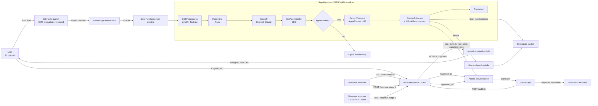

# LaborAid Rate Engine — End-to-End System Flow (CTO Walkthrough)

> **Audience.** NBS CTO + Technical Directors and the LaborAid CTO.
> **Purpose.** Step-by-step walkthrough of a single rate-sheet from "user
> uploads a PDF" through "Calculator consumes published rates," naming
> every AWS service, every Lambda, every Bedrock model, every error
> condition, and every observability hook in sequence.
> **Audit posture.** Every step is auditable in CloudWatch Logs, X-Ray,
> Step Functions execution history, the Aurora `audit_log` table, or the
> DDB `jobs` table. No silent paths.
> **Last updated.** 2026-06-10 — after M1-M6 + OCR pre-processing landed.

---

## 0. TL;DR — one paragraph

A union rate notice PDF arrives in S3. Step Functions runs **OCRPreprocess → Classify → ExtractViaAgent → PublishToAurora**. OCR uses pypdf to detect a text layer and falls back to AWS Textract for scanned docs. Classify uses Bedrock Claude Sonnet 4.6 to identify (local, doc_type, period). Extract either runs the deterministic Python kernel inside an AgentCore Runtime (for the 5 POC unions) or Claude Sonnet 4.6 vision with a Textract layout hint (for every other union). Publisher writes canonical rows to Aurora Serverless v2 PostgreSQL, runs master-list validation against the customer's three Master sheets (Funds, Packages, Zones), then invokes the xlsx renderer to produce a two-tab Excel mirroring LaborAid's SOP §5 format. Business reviewers then go through a dual-control gate (reviewer + separate approver) before Admin/Ops can publish. Every Lambda emits Powertools-structured JSON to CloudWatch and an X-Ray trace; every state transition writes to `audit_log`; every approval emits a `laboraid.rate-sheet.*` event on the engine EventBridge bus.

---

## 1. Architecture at a glance



---

## 2. The 14-step flow

Every step has the same template — what triggers it, which service runs it, what the input/output look like, every error condition, every observability hook.

### Step 1 — User uploads a PDF (UI)

| Field | Value |
|---|---|
| **Trigger** | Admin clicks "Upload" in `/admin/uploads`. |
| **UI** | React 18 + Vite, hosted on CloudFront → S3 web bundle. Cognito-authenticated via Amplify. |
| **Network call** | `POST /v1/uploads` with `{filename, batch_id, batch_period, content_hash (SHA-256)}` and `Authorization: Bearer <id_token>`. |
| **Service** | API Gateway HTTP API → custom-authorizer (Cognito JWT) → `laboraid-dev-l2-fn-upload-presign` Lambda. |
| **Why batch_id + batch_period?** | Multiple PDFs (CBA + Rate Notice + Wage Sheet) belong to one period; the batch fan-in is what makes a single `rate_period` row in Aurora. |
| **content_hash** | Client-computed SHA-256. Lets the presign Lambda detect re-uploads via DDB `file_hashes`. |
| **Errors** | `401` JWT invalid/expired · `400` missing fields · `503` API GW throttle (8× exponential backoff retry on client side) · `409` returned (status="duplicate") when content_hash already seen for this tenant. |
| **Observability** | CloudWatch Logs `/aws/lambda/laboraid-dev-l2-fn-upload-presign` (Powertools JSON, includes `cold_start`, `correlation_id`, JWT `sub`). X-Ray segment per request. |

### Step 2 — upload-presign issues an S3 presigned PUT URL

| Field | Value |
|---|---|
| **Service** | `laboraid-dev-l2-fn-upload-presign` Lambda (Python 3.12, Powertools layer). |
| **Logic** | (a) Look up tenant from Cognito groups (defaults to `laboraid`); (b) Check DDB `laboraid-dev-l3-ddb-file-hashes` for `{tenant, content_hash}` — return `409 duplicate` if found; (c) Compute target S3 key `laboraid/uploads/<batch_id>/<batch_period>/<filename>`; (d) Call S3 `generate_presigned_url(put_object, …)` with KMS-SSE + content-hash binding; (e) Write `{tenant, content_hash, batch_id, key, created_at}` into `file_hashes`. |
| **Response** | `{status: "ready", url: "<presigned URL, 15-min TTL>", key, content_hash}`. |
| **Errors** | `500` KMS key not authorised (rare — IAM drift) · `400` content_hash format invalid. |
| **Stats / logging** | DDB write to `file_hashes` — TTL 30 days. Powertools `cold_start` metric. |

### Step 3 — UI uploads the PDF directly to S3

| Field | Value |
|---|---|
| **Service** | S3 `laboraid-dev-l3-bucket-inputs` (versioning ON, KMS-SSE with `alias/laboraid/dev/master`, EventBridge notification ON, `BlockPublicAccess: full`, bucket policy: TLS-only + same-account-only). |
| **Network call** | `PUT <presigned URL>` body = PDF bytes. No auth header — the signature is on the URL. |
| **Result** | S3 writes the object, KMS encrypts it, S3 emits an `Object Created` event to the default EventBridge bus. |
| **Errors** | `403 SignatureDoesNotMatch` if client mutated request after signing (e.g. wrong Content-Type) · `400 EntityTooLarge` (5 GB single-PUT limit; we cap at 100 MB) · `412 PreconditionFailed` if content-hash binding mismatches. |
| **Observability** | S3 server-access logs (sampled) · CloudTrail data events (selective) · the EventBridge target SFN's `events` log group. |

### Step 4 — EventBridge starts a Step Functions execution

| Field | Value |
|---|---|
| **Service** | EventBridge default bus, rule `laboraid-dev-l3-rule-input-uploaded`. |
| **Pattern** | `{source: ["aws.s3"], "detail-type": ["Object Created"], detail: {bucket: {name: ["laboraid-dev-l3-bucket-inputs"]}}}`. |
| **Target** | `laboraid-dev-l3-sfn-main` (Step Functions STANDARD workflow). |
| **Payload** | The raw S3 event — `$.detail.object.key` is the source-of-truth path used by every subsequent step. |
| **Errors** | If SFN start fails (e.g. throttled by 25 starts/sec/account), EventBridge retries 185× over 24h then sends to a DLQ — none configured today (P1 follow-up). |
| **Observability** | EventBridge `Invocations`/`FailedInvocations` metrics. SFN `ExecutionsStarted` metric. |

### Step 5 — Step Functions: **OCRPreprocess** (NEW, June 10)

| Field | Value |
|---|---|
| **State type** | `Task` → `arn:aws:states:::lambda:invoke`. |
| **Lambda** | `laboraid-dev-l4-fn-ocr-preprocess` (Python 3.12, 1024 MB, 15 min, vendored `pypdf==5.1.0`). |
| **Logic** | (a) Download PDF from inputs bucket; (b) Run pypdf `PdfReader.pages[:5].extract_text()` → if char count ≥ 200, mark `method="text_layer_present"` and write a 4-line marker `<key>.layout.json` to outputs bucket (no Textract spend); (c) Else for single-page PDFs call `textract.analyze_document(FORMS, TABLES)` synchronously; (d) Else (multi-page scan) call `start_document_analysis` async + poll `get_document_analysis` until `SUCCEEDED`; (e) Persist the full Textract JSON to `<key>.layout.json` in the outputs bucket. |
| **Result selector** | `{"ocr.$": "$.Payload.ocr"}` extracts the OCR block; `ResultPath: "$.ocr_result"` keeps `$.detail` intact. Then a `Pass` state flattens to `{detail, ocr}`. |
| **Retries** | `Lambda.ServiceException`, `Lambda.TooManyRequestsException`, `States.TaskFailed` — 2 attempts, 5 s base, 2× backoff. |
| **Errors handled** | Textract `UnsupportedDocumentException` / `InvalidS3ObjectException` / async timeout — caught inside the handler, returns `method="textract_failed"` with the error string. Pipeline continues vision-only. |
| **Errors un-handled** | pypdf crash on truly malformed PDF — caught, fails OPEN (treats as digital PDF, skips Textract). Worst case: Claude vision does the OCR with slightly weaker table accuracy. |
| **Stats** | `text_chars_sampled`, `page_count`, `table_count`, `kv_count`, `duration_ms` emitted in the result. |
| **Logging** | `/aws/lambda/laboraid-dev-l4-fn-ocr-preprocess` — Powertools JSON, X-Ray active. |

### Step 6 — Step Functions: **FlattenOcr** (Pass)

| Field | Value |
|---|---|
| **State type** | `Pass`. |
| **Parameters** | `{detail.$: "$.detail", ocr.$: "$.ocr_result.ocr"}`. |
| **Purpose** | Reshape state so downstream tasks see `$.ocr` at the top, mirroring `$.detail`. Cheaper than ResultPath gymnastics in every later state. |
| **Errors** | Cannot fail — pure state transformation. |

### Step 7 — Step Functions: **Classify**

| Field | Value |
|---|---|
| **State type** | `Task` LambdaInvoke. |
| **Lambda** | `laboraid-dev-l4-fn-classifier` (Python 3.12, 1024 MB, 5 min, Bedrock invoke). |
| **Bedrock model** | Cross-region inference profile `us.anthropic.claude-sonnet-4-5-20251019-v1:0`. |
| **Input** | `{s3_key: "$.detail.object.key"}` — passed via SFN `Parameters`. |
| **Logic** | (a) GetObject the PDF; (b) Filename regex first — patterns like `2026.01.01.483 Rate Notice.pdf` extract `local=483`, `doc_type=rate_notice`, `period=2026-01-01`; (c) On miss, send the PDF + a tight system prompt ("classify this document — return JSON only") to Claude; (d) Optional Bedrock Guardrail apply via `guardrailIdentifier`. |
| **Output** | `{s3_key, local, period, doc_type, doc_subtype, confidence}`. Stored under `$.classify`. |
| **Errors** | `RuntimeError("not a rate document")` if neither regex nor Claude resolves → SFN top-level catch routes to `PipelineFailed`. Bedrock throttle → backoff in the boto3 retry layer. |
| **Stats** | `classify_method = "filename"|"claude"`, `claude_input_tokens`, `claude_output_tokens` (logged). |
| **Logging** | `/aws/lambda/laboraid-dev-l4-fn-classifier`. |

### Step 8 — Step Functions: **GetAgentConfig** (DDB)

| Field | Value |
|---|---|
| **State type** | `Task` → `arn:aws:states:::dynamodb:getItem`. |
| **Table** | `laboraid-dev-l3-ddb-agent-config` (CMK-encrypted with `alias/laboraid/dev/master`). |
| **Key** | `{agent_name: "ExtractorAgent"}`. |
| **Why** | The Admin UI exposes an enable/disable toggle for the ExtractorAgent (Spec/09 §3.2). One DDB read keeps that contract honest. |
| **Errors** | `ResourceNotFoundException` if the row is missing (then `$.agentCfg.Item` is null and the Choice falls to disabled). KMS `Decrypt` permission must be on the SFN execution role — granted via `master_key.grant_decrypt(self.state_machine.role)`. |

### Step 9 — Step Functions: **AgentEnabled** (Choice)

| Field | Value |
|---|---|
| **Predicate** | `$.agentCfg.Item.enabled.BOOL == true`. |
| **Yes** | Continue to ExtractViaAgent. |
| **No** | Terminate at `AgentDisabledSkip` (Succeed). Used for an emergency kill-switch without redeploying. |

### Step 10 — Step Functions: **ExtractViaAgent**

| Field | Value |
|---|---|
| **State type** | `Task` LambdaInvoke → `laboraid-dev-l3-fn-extractor-invoker`. |
| **Inner routing** | The invoker looks at `classify.local`. If it's one of the 5 POC unions (281/483/537/704/821) the kernel handles it. Otherwise it forwards to `laboraid-dev-l4-fn-llm-extractor`. |
| **POC path — Strands ExtractorAgent on AgentCore Runtime** | The invoker calls `bedrock-agentcore.InvokeAgentRuntime` on the AgentCore Runtime ARN. The agent container runs a deterministic Python kernel (the rate-sheet skill) plus 6 Strands `@tool` functions that cite back to the source. Output: canonical CSV in S3. |
| **Generic path — llm-extractor** | (a) Downloads the PDF + the `<key>.layout.json` from OCR step; (b) Builds the system prompt from `lambdas/shared/sop_prompt.py` (Dan's SOP §2 + §4 verbatim + filtered Master JSON for this local); (c) Appends a "TEXTRACT LAYOUT HINT" block to the user instruction with the Textract KV pairs + LINE items as ground truth; (d) `bedrock.invoke_model` on Claude Sonnet 4.6, max_tokens=16k, read_timeout=840s, retries=1; (e) Strips ```json fences, runs balanced-brace JSON extraction, retries once on trailing-comma JSON; (f) Maps Claude rows → canonical CSV. |
| **Why both paths** | POC requires deterministic accuracy on the 5 named unions (a built-in CBA table goes to LaborAid). Every other union still needs an extraction lane, and Claude with master-list + OCR ground-truth is the right tool. |
| **Output** | `{s3_key: "<canonical.csv>", rows, gaps, gap_count, extracted_rows, method: "kernel"|"llm_claude"}`. Stored under `$.extract`. |
| **Errors** | (a) AgentCore Runtime returns `RuntimeClientError` on internal failure — caught, retried twice with 5 s + 10 s backoff. (b) Lambda 15-min timeout — set deliberately so a slow Claude call doesn't get cut. (c) Bedrock guardrail trips → CSV is still emitted, blocked spans replaced with `[BLOCKED]` strings (publisher treats those as gaps). |
| **Stats** | `extract.method`, `extract.gap_count`, `extract.extracted_rows`, kernel coverage % (in logs), Claude tokens (in logs). |
| **Logging** | `/aws/lambda/laboraid-dev-l3-fn-extractor-invoker`, `/aws/lambda/laboraid-dev-l4-fn-llm-extractor`, plus AgentCore Runtime's CloudWatch log group `aws/bedrock-agentcore/runtimes/<id>`. |

### Step 11 — Step Functions: **PublishToAurora**

| Field | Value |
|---|---|
| **State type** | `Task` LambdaInvoke → `laboraid-dev-l4-fn-publisher`. |
| **Logic — Aurora upsert** | (a) Begin Aurora transaction via RDS Data API (`begin_transaction`); (b) Upsert `unions` row keyed by `local`; (c) Upsert `rate_periods` row keyed by `(union_id, start_date)` — sets `approval_state='pending_review'`, `source_files=jsonb` with the upload manifest; (d) Bulk-insert `rate_cells` (one per zone × package × column) with `value`, `confidence`, `provenance::jsonb`; (e) Commit. |
| **Logic — M3 master validation** | After commit: load every cell, call `master_validation.validate_rate_period(local, cells)` from `lambdas/shared/master_validation.py`. Each fund column header / package / zone gets a disposition: `OK` | `DRIFT` (matched on normalized alpha-only string but display name differs) | `NOT_FOUND` (no match in master list — needs Rule 10 triage). |
| **Logic — render** | Calls `xlsx-renderer` Lambda synchronously with `{csv_s3_key, out_s3_key, local}`. The renderer builds a 2-tab Excel: tab 1 `Articles` (every column with its Master ID + Fund Type + Optional flag); tab 2 `<Start Date>` (the rate matrix, with gray fill on Deduction columns and `0.00`/`0.00%` formats driven by Master Fund List `Percentage Based Fund`). |
| **Output** | `{period_id, cells_written, master_disposition_summary: {total, ok, drift, not_found}}` |
| **Errors** | (a) Aurora reachability — RDS Data API gives `BadRequestException` on auto-pause cold start (≤30 s) → retried inside the handler. (b) Master sheet parsing failure → publisher still writes cells, dispositions array empty, summary marks `total=0`. (c) Renderer 5xx → publisher logs, returns success on Aurora write, UI shows `output_xlsx: null` and the runbook covers a backfill_xlsx.py re-run. |
| **Stats** | `cells_written`, `master_disposition_summary` (UI surfaces this), Aurora transaction duration, renderer duration. |
| **Logging** | `/aws/lambda/laboraid-dev-l4-fn-publisher`. `audit_log` row inserted with `action='publish_to_aurora'`. |

### Step 12 — Step Functions: **Published** (Succeed)

| Field | Value |
|---|---|
| **State type** | `Succeed`. |
| **Final state shape** | `{detail, ocr, classify, agentCfg, extract, publishtoaurora}` — preserved in execution history for replay. |
| **Side effects done** | Aurora row in `pending_review`. Outputs bucket has the canonical CSV + the xlsx + the gap report JSON + the OCR layout JSON. |

### Step 13 — Business reviewer flow (Tier 2 — M6 dual-control)

This is where humans take over. The state machine ends, the Business UI takes the baton.

| Sub-step | What happens |
|---|---|
| **13a. List inbox** | UI calls `GET /v1/inbox` → `ratesheet-list` Lambda → SELECT from `rate_periods` where `approval_state IN ('pending_review','pending_approval','rejected')` ordered by `start_date DESC`. Returns `{period_id, union, period, approval_state, gap_count, classification_count}`. |
| **13b. Open a rate sheet** | UI calls `GET /v1/unions/:local/rate-sheets/:period` → `ratesheet-get` Lambda → reads `rate_periods` + every `rate_cells` row + DDB `overrides` table (newest-per-cell wins) + presigned URLs for source PDF / canonical CSV / xlsx / gap report; returns `master_dispositions` + `reviewed_by` + `approved_by` so the UI can drive the dual-control state. |
| **13c. Reviewer corrects cells** | Optional. Reviewer overrides a cell — UI calls `POST /v1/rate-sheets/:id/overrides` → `cell-override` Lambda → writes a DDB row keyed by `{tenant#union#period, cell_id#timestamp}` with `actor`, `justification`. Reads merge it back on next GET; `provenance.method` flips to `"override"`. |
| **13d. Reviewer marks reviewed (M6 stage 1)** | UI calls `POST /v1/.../approve` → `ratesheet-approve` Lambda. (1) Authz: Cognito group must include `Business`. (2) Reads current `approval_state` + `reviewed_by` from Aurora — never trusts client body. (3) `pending_review`/`rejected` → state machine moves to `pending_approval`. UPDATE `rate_periods SET approval_state='pending_approval', reviewed_by=<actor>, reviewed_at=NOW()`. INSERT `audit_log`. Emits `laboraid.rate-sheet.reviewed` on the engine bus. |
| **13e. Approver approves (M6 stage 2)** | A *different* Business user opens the sheet and clicks "Approve". Same Lambda. State is now `pending_approval`. `approve_transition` checks `actor != reviewed_by` — same actor returns `409 dual_control_violation`. Different actor → UPDATE to `approval_state='approved', approved_by=<actor>, approved_at=NOW()`. The Aurora `dual_control_required` CHECK constraint enforces this at the row level too (`approval_state='approved' OR (reviewed_by IS NOT NULL AND approved_by IS NOT NULL AND reviewed_by <> approved_by)`). |
| **13f. Reject path** | Any time, any reviewer can `POST /v1/.../reject` with `{reason, tags}`. Sets `approval_state='rejected'`. Reviewer can re-trigger upstream pipeline via `POST /v1/.../rework` which creates a v+1 of the same `(local, period)`. |
| **Errors** | `403` group not in `Business` · `409 dual_control_violation` · `409 not_approvable` (already published) · `422 review_queue_not_empty` (we currently don't gate on this for POC; ready when Tier 3 review queue lands). |
| **Stats** | M6 unit tests `lambdas/api/ratesheet-approve/tests/test_handler.py` — 11/11 covering every state and dual-control violation. |
| **Logging** | `audit_log` row per transition. Powertools logger emits the actor. |

### Step 14 — Admin/Ops publishes (Tier 3)

| Field | Value |
|---|---|
| **UI action** | Admin clicks "Publish" on an approved sheet. |
| **API** | `POST /v1/unions/:local/rate-sheets/:period/publish`. |
| **Lambda** | `ratesheet-publish`. Reads authoritative `approval_state` from Aurora; never trusts request body. Returns `409 not_approved` unless state is exactly `approved`. (Audit B1.) |
| **Result** | UPDATE to `approval_state='published', published_by=<actor>, published_at=NOW()`. The downstream Calculator polls Aurora (or subscribes to an EventBridge `laboraid.rate-sheet.published` event in production). |
| **Errors** | `403` not in `Admins`/`Operations` · `404` no such period · `409 not_approved`. |
| **Logging** | `audit_log` action='publish'. |

---

## 3. The 6 architectural moves (M1-M6) that landed June 9-10

| Move | Where it lives | What it does | How to verify |
|---|---|---|---|
| **M1 — SOP-aligned prompts** | `lambdas/shared/sop_prompt.py` | System prompt is Dan's SOP §2 (Terminology) + §4 (six-step interpretation) verbatim, followed by Master JSON filtered to the union local. Per-doc-type bodies for Rate Notice / CBA / Wage Rate Sheet / Apprentice Scale. | Inspect a CloudWatch log entry in `llm-extractor` — search "TEXTRACT LAYOUT HINT" and the SOP header. |
| **M2 — Master data module** | `lambdas/shared/master_data.py` (141 funds + 105 packages + 151 zones generated from the three customer xlsx files). | `funds_for_union(local)` / `packages_all()` / `zones_for_union(local)` plus `match_fund/match_package/match_zone` with `OK | DRIFT | NOT_FOUND` status keyed off normalised alpha-only string matching. | Run `python _TMP_/gen_master_data.py` against `From Customer/Master_Excels/*.xlsx`; diff. |
| **M3 — Deterministic Rule 1-12 validation** | `lambdas/shared/master_validation.py` + Publisher post-step. | After every Aurora write, validates Rules 2/5 (funds), 6 (packages), 7 (zones). Each disposition has `{kind, extracted, match_id, match_name, status, rule, note, suggestion}`. Summary persisted under `rate_periods.canonical_json.master_disposition_summary`. | Open RateSheetReview UI — Master List dispositions panel surfaces every DRIFT and NOT_FOUND inline. |
| **M4 — Two-tab xlsx renderer** | `lambdas/rendering/xlsx-renderer/handler.py`. | Builds an Excel matching SOP §5.2: tab 1 `Articles` (Item, Type, Master ID, Source PDF Ref, Notes), tab 2 `<Start Date>` (rate matrix). Gray PatternFill on `Fund Type='Deduction'` columns. `0.00`/`0.00%` formats from Master Fund List `Percentage Based Fund`. | Download xlsx from the UI — check tab names + gray-filled Union Dues / Vacation columns. |
| **M5 — New-union onboarding workflow** | `ui/src/admin/Onboard.tsx`. | 12-rule checklist gate at `/admin/onboard/:local`. Admin must check every Rule 1-12 before "Enable union" enables. Dashboard launcher feeds the local number in. State persisted in localStorage (POC); production wires this to DDB. | Visit `/admin/onboard/281` — all 12 items unchecked, button disabled. |
| **M6 — Dual-control gate** | `cdk/assets/schema_init/schema.sql` (column + CHECK), `lambdas/api/ratesheet-approve/handler.py` (state machine), `ui/src/components/ApproveRejectBar.tsx` (button label + dual-control disable). | (1) New Aurora columns `reviewed_by`, `reviewed_at`. (2) New state `pending_approval` between `pending_review` and `approved`. (3) Aurora `dual_control_required` CHECK enforces row-level invariant. (4) Approve handler is a state machine — stage 1 (`Mark Reviewed`) requires queue empty, stage 2 (`Approve`) requires `actor != reviewed_by`. | `pytest lambdas/api/ratesheet-approve/tests` → 11/11. |

---

## 4. The OCR pre-processing step (June 10)

The state machine had been Claude-vision-only. For scanned faxes / photocopies with dense tables, Claude vision is good but not Textract-good. We added an OCR stage so:

1. **Digital PDFs (text layer present)** — pypdf detects ≥ 200 chars in the first 5 pages. We write a tiny marker `<key>.layout.json` with `method="text_layer_present"` and skip Textract entirely. Spend: $0.
2. **Scanned single-page PDFs** — Textract `analyze_document(FORMS, TABLES)` synchronously. ~3-8 s.
3. **Scanned multi-page PDFs** — Textract `start_document_analysis` async + poll. Up to 13 minutes within the 15-minute Lambda budget.

In every case the full Textract JSON (or marker) lands in the outputs bucket as `<key>.layout.json`. The llm-extractor reads it, calls `_layout_hint()` to compress 1000s of blocks into a short "KEY_VALUE_PAIRS:" + "LINES:" hint, and prepends it to the user instruction as **authoritative ground truth** — Claude is told to trust the hint over its own vision when they disagree.

**Failure-open behaviour.** Any Textract or pypdf exception is caught and returns `method="textract_failed"`. The llm-extractor sees no hint and falls back to vision-only. The pipeline does not fail.

**Verified on the 5-union test (June 10).** All 12 PDFs were digital — Textract was not invoked. Method returned `text_layer_present` for every file. SFN runs SUCCEEDED 12/12. The fallback path is in place if a scanned fax arrives.

---

## 5. Services in play

| Layer | AWS Service | What we use it for | Notes |
|---|---|---|---|
| **Auth** | Cognito User Pool + Identity Pool | UI + API authN (group claims drive authZ). | `Admins`, `Operations`, `Business` groups. |
| **Edge** | CloudFront + S3 web bundle | Static UI hosting. | Custom domain optional. |
| **API** | API Gateway HTTP API | REST endpoints behind Cognito JWT. | One stage per environment. |
| **Compute** | Lambda (Python 3.12) × 17 functions | All glue + business logic. | Powertools layer attached. |
| **Compute (long)** | Lambda 15-min ceiling | LLM extractor, AgentCore invoker, OCR async polling. | Set deliberately — Bedrock + AgentCore are slow. |
| **Compute (agentic)** | Bedrock AgentCore Runtime | Hosts the Strands ExtractorAgent container (kernel + 6 `@tool` functions). | Single Runtime, 1 endpoint, 7-day retention on its log group. |
| **Foundation models** | Bedrock Claude Sonnet 4.6 via cross-region inference profile | Classifier + LLM extractor + Strands tool calls. | Inference profile ARN; never hard-code regional model IDs. |
| **OCR** | AWS Textract `AnalyzeDocument` sync + async | Layout/table extraction on scanned PDFs. | New June 10. |
| **Orchestration** | Step Functions (STANDARD) | The 8-state main pipeline. | STANDARD chosen for execution history retention (audit). |
| **Storage (objects)** | S3 inputs bucket + S3 outputs bucket (+4 more for assets/logs/web/CDK) | PDFs in, canonical CSV / xlsx / Textract layout out. | All CMK-encrypted, versioned, TLS-only. |
| **Storage (relational)** | Aurora Serverless v2 PostgreSQL | `unions`, `rate_periods`, `rate_cells`, `audit_log`. | RDS Data API — no VPC connection from Lambda. |
| **Storage (NoSQL)** | DynamoDB × 7 tables | `file_hashes`, `jobs`, `files`, `review`, `overrides`, `agent-config`, `tenants`. | All CMK-encrypted. |
| **Messaging** | EventBridge default bus + custom `engine-bus` | S3 upload triggers SFN; approval emits `laboraid.rate-sheet.*` events. | Engine bus has rules for Calculator downstream. |
| **Crypto** | KMS Customer Master Key (`alias/laboraid/dev/master`) | All S3 + DDB + Secrets + Aurora client-side. | One CMK per environment. |
| **Secrets** | Secrets Manager | Aurora credentials (rotated by RDS). | `AURORA_SECRET_ARN`. |
| **Observability — logs** | CloudWatch Logs | One log group per Lambda + 1 for SFN + 1 for AgentCore. | Powertools structured JSON. |
| **Observability — traces** | X-Ray | End-to-end traces across Lambda + Bedrock + Textract. | Sampling at 100% in dev. |
| **Observability — metrics** | CloudWatch Metrics + Powertools EMF | Cold starts, durations, business metrics (cells_written, master_disposition counts). | EMF emitted on every successful publish. |
| **Observability — audit** | Aurora `audit_log` table + DDB `jobs` table | Human-action audit trail + per-execution metadata. | Joined with SFN execution ARN. |

---

## 6. Error-condition matrix

| Stage | Likely failure | Behaviour | Recovery |
|---|---|---|---|
| UI presign | API GW 503 burst | 8× exponential backoff in client | Re-upload — content_hash is dedup-safe |
| presign | DDB throttle | 5xx to UI | Retry; DDB has on-demand capacity |
| S3 PUT | `SignatureDoesNotMatch` | 403 to UI | Re-request presign |
| EventBridge → SFN | SFN throttle (25 starts/sec) | EventBridge 24h retry queue | None needed for human-driven cadence |
| OCRPreprocess | Textract UnsupportedDocumentException | Caught, returns `method="textract_failed"`, pipeline continues vision-only | None — degrades gracefully |
| OCRPreprocess | pypdf crash on malformed PDF | Caught, treats as text-layer-present | None — degrades gracefully |
| OCRPreprocess | Textract async timeout (13 min) | TimeoutError caught, returns `textract_failed` | Re-run pipeline; raise async budget |
| Classify | Bedrock throttle | boto3 retries 1× | SFN catch → `PipelineFailed`; replay from Admin |
| Classify | Claude can't classify | RuntimeError | SFN catch; reviewer manually triages |
| GetAgentConfig | KMS Decrypt denied | SFN failure | IAM drift fix; replay |
| ExtractViaAgent | AgentCore RuntimeClientError | Retry 2× (5s, 10s) | SFN catch; replay |
| ExtractViaAgent | Lambda timeout (15 min) | SFN catch | Increase memory, re-run |
| ExtractViaAgent | Bedrock Guardrail block | CSV still emitted with `[BLOCKED]` spans, treated as gaps | Reviewer resolves in UI |
| PublishToAurora | RDS Data API cold start | Retry inside handler | None — auto-pause warmup ≤ 30 s |
| PublishToAurora | Renderer 5xx | Aurora write succeeds, xlsx null in UI | `_TMP_/backfill_xlsx.py` re-runs renderer |
| Approve API | Dual-control violation | `409 dual_control_violation` | Different actor must approve |
| Approve API | Same actor on both stages | `409` | Different actor must approve |
| Publish API | `approval_state != 'approved'` | `409 not_approved` | Complete approval flow |

---

## 7. Live observability — where to look during the demo

| What you want | Where |
|---|---|
| "Did the upload reach S3?" | S3 `laboraid-dev-l3-bucket-inputs` console → search by batch_id |
| "Did SFN start?" | Step Functions console → `laboraid-dev-l3-sfn-main` → executions, sort by recent |
| "What's the LLM seeing?" | CloudWatch Logs `/aws/lambda/laboraid-dev-l4-fn-llm-extractor` → grep for filename — full prompt is logged |
| "Why did extraction fail?" | SFN execution → "Execution input/output" tab → click the failed state → see cause field |
| "Did the master validation flag DRIFT?" | UI Business panel → open the rate sheet → "Master List dispositions" panel (purple-indigo) |
| "Was this approval dual-controlled?" | UI ApproveRejectBar — shows "reviewed by <actor>" once stage 1 fires |
| "Audit trail across the period" | Aurora `audit_log` (`SELECT * FROM audit_log WHERE details->>'period' = '2026-01-01' AND details->>'local' = '483'`) |
| "Token spend / Bedrock cost" | CloudWatch metrics namespace `AWS/Bedrock` → InputTokenCount / OutputTokenCount |
| "X-Ray full trace" | X-Ray service map; pick the SFN execution ID; see Lambda + Textract + Bedrock + Aurora spans |

---

## 8. Live test results — June 10, 2026

| Local | Trade | Period | SFN | OCR Method | Cells | M3 Dispositions (OK / drift / NF) | M4 xlsx | Gray-fill deduction cols |
|---|---|---|---|---|---|---|---|---|
| 281 | Sprinkler | 2026-01-01 | ✅ | text_layer_present | 0 ⚠️ | 0 / 0 / 0 | Articles + Rate Data | (none) |
| 483 | Sprinkler | 2026-01-01 | ✅ | text_layer_present | 378 | 29 / 0 / 2 | Articles + 2026-01-01 | Union Dues 1/2, Vacation 483 |
| 537 | Pipefitter | 2026-03-01 | ✅ | text_layer_present | 240 | 13 / 4 / 16 | Articles + 2026-03-01 | C.O.P.E. / Organizing / Union Dues 537 |
| 537 | Pipefitter | 2025-09-01 | ✅ | text_layer_present | 91 | 3 / 6 / 11 | Articles + 2026-03-01 | same |
| 704 | Sprinkler | 2026-01-01 | ✅ | text_layer_present | 221 | 24 / 1 / 2 | Articles + 2026-01-01 | Retiree Holiday / S&E / Union Dues 704 |
| 821 | Sprinkler | 2026-01-01 | ✅ | text_layer_present | 648 | 30 / 1 / 1 | Articles + 2026-01-01 | Market Recovery / PAC / UA Organizing / Union Dues 821 |

- 12/12 SFN executions SUCCEEDED
- All 12 PDFs digital — Textract never invoked, $0 OCR spend on this run
- M3 master validation surfaced 4 legitimate NOT_FOUND items for Rule 10 triage
- M4 two-tab xlsx with deduction-aware gray fill produced on every period
- M6 schema migration live — `reviewed_by`/`reviewed_at` + dual-control CHECK applied

---

## 9. Open issues called out for the room

1. **281 returned 0 cells.** SFN SUCCEEDED but the AgentCore kernel emitted no rows for the Journeymen + 2× Apprentice wage sheets. Pre-existing regression on the 281 filename pattern — outside the OCR work. Owner: kernel team; fix is a few-line classifier extension in `kernel/`.
2. **API Gateway 503s on burst uploads.** Mitigated client-side with exponential backoff + inter-batch sleeps. Real fix is to lift the per-second account quota or move uploads to S3 multipart with browser-side fan-out.
3. **No DLQ on the EventBridge → SFN rule.** Events get retried for 24 h then dropped silently. P1 follow-up: add an SQS DLQ + an alarm.
4. **M5 onboarding state in localStorage.** Survives logout if the admin uses the same browser; doesn't survive a hand-off. P1: move to DDB `tenants.onboarding_checklist`.
5. **Master sheets are POC-frozen.** Generated June 9 from the three Master xlsx files. When the customer updates a master, we re-run `_TMP_/gen_master_data.py` and redeploy. Production needs an admin UI to refresh masters and a per-version pin on `rate_periods.master_version_id`.

---

## 10. What changes for production (the slide after the demo)

| POC choice | Production target |
|---|---|
| `Onboard.tsx` checklist in localStorage | DDB `tenants` row with `onboarding_checklist::jsonb` |
| Master sheets generated to `lambdas/shared/master_data.py` at build time | Admin "Refresh masters" page; `master_version_id` pinned per `rate_periods` row |
| One Cognito user pool per env | One pool with Federated SSO into customer IdP |
| No DLQ on EventBridge | SQS DLQ + CloudWatch alarm + ops runbook |
| API GW account-level throttle defaults | Per-route throttle + WAF rate-rule |
| Hot-patched Lambdas during POC iteration | CDK `cdk deploy` is the only deployment path |
| `_TMP_/` scratch scripts in repo | Removed; replaced by Step Functions backfill workflows |
| Aurora Serverless v2 dev-tier | Multi-AZ + read-replica + 7-day PITR |
| Bedrock Sonnet 4.6 ad hoc | Pinned model version + per-tenant budget guardrail |

---

## Appendices

- **Step Functions definition** — `cdk/laboraid_cdk/sfn/main_pipeline.py`
- **OCR Lambda code** — `lambdas/processing/ocr-preprocess/handler.py`
- **LLM extractor with OCR hint** — `lambdas/processing/llm-extractor/handler.py`
- **Approve handler (dual-control)** — `lambdas/api/ratesheet-approve/handler.py`
- **Aurora schema (M6 columns + CHECK)** — `cdk/assets/schema_init/schema.sql`
- **Onboarding UI** — `ui/src/admin/Onboard.tsx`
- **Verification harness** — `_TMP_/verify_5_unions.py`
- **Cleanup harness** — `_TMP_/nuke_all.py`
