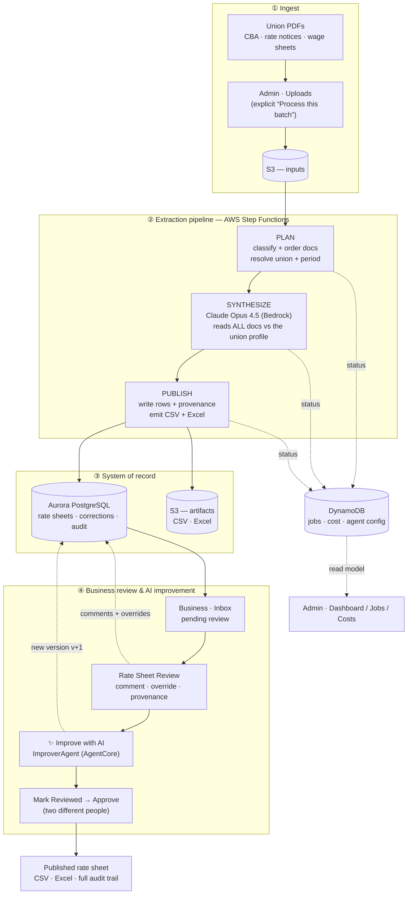
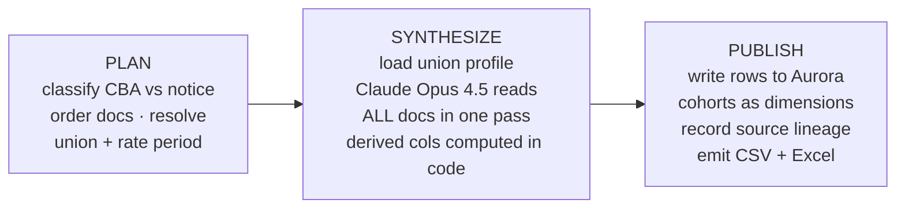
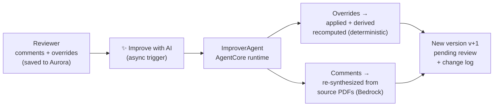
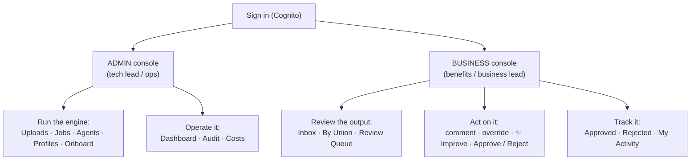
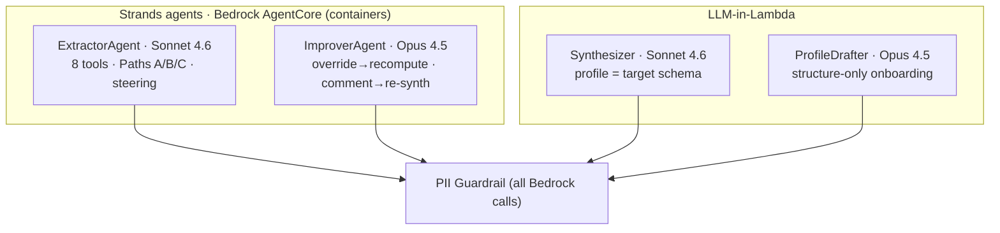

# Architecture

**LaborAid Rate Engine** turns a union's benefit-fund PDFs — collective bargaining
agreements (CBAs) plus periodic rate notices and wage sheets — into clean, structured,
**reviewed and approved** rate sheets that remittance and benefits systems consume.

Every dollar value is **extracted by AI from the source documents and mapped to the
union's own schema** — never copied from an answer key, never invented. What the
documents don't contain is **flagged as a gap**, not guessed. Two different people must
review and approve before anything publishes.

This page shows, top to bottom: **how data flows**, **the services** that run it, **the
two pipelines** (extraction + AI improvement), and a **map of the Admin and Business
consoles** — each detailed on its own tab.

---

## 1 · Data flow

How a union's PDFs become a published rate sheet — and how a reviewer's corrections feed
the AI to produce a better, versioned sheet. Solid arrows are the **content path** (the
authoritative numbers, in Aurora); dashed arrows are **operational telemetry** (job
status, cost — in DynamoDB). The two never mix.

**Read it in one sentence:** PDFs go in → Step Functions plans, synthesizes with Claude
Opus 4.5, and publishes to Aurora → a business reviewer comments/overrides and can ask the
AI to **improve** the sheet into a new version → two people approve → it publishes, with a
complete audit trail. Job status and cost stream separately to DynamoDB so the dashboards
stay fast and never touch the authoritative data.

---

## 2 · Services

Every layer is serverless and managed; there are **no servers to patch** and the system
scales to zero between batches.

| Layer | Service | Role in LaborAid |
|---|---|---|
| **Access** | Amazon Cognito | Sign-in; role groups (Admin / Business); every API route gated |
| **Edge** | CloudFront + S3 | Hosts the React app and this walkthrough; HTTPS, caching |
| **API** | API Gateway (HTTP) + Lambda | One Lambda per route; thin, stateless handlers |
| **Orchestration** | AWS Step Functions | The extraction pipeline — Plan → Synthesize → Publish |
| **AI (extraction)** | Amazon Bedrock — Claude Opus 4.5 | Reads all docs against the union profile → the rate sheet |
| **AI (improvement)** | Bedrock AgentCore + Strands | The **ImproverAgent** — a long-running agent that applies a reviewer's corrections |
| **Guardrail** | Bedrock Guardrails | Masks any personal data in the PDFs **before** the model sees it |
| **Content store** | Aurora Serverless v2 (PostgreSQL) | Rate sheets, corrections, approvals, audit — the **legal system of record** |
| **Telemetry store** | DynamoDB | Job status, cost, agent config — **operational** data, read by dashboards |
| **Files** | Amazon S3 | Source PDFs (inputs) and CSV/Excel artifacts (outputs) |
| **Events** | Amazon EventBridge | Step Functions status → a writer that builds the jobs read-model |
| **Images** | Amazon ECR | ARM64 container images for the AI agents |

> **Why two databases (polyglot persistence).** Authoritative rate-sheet content,
> corrections, approvals, and the audit trail live in **Aurora** — relational, queryable,
> defensible to a trustee or auditor. High-volume operational telemetry (job progress,
> cost) lives in **DynamoDB**, read by the dashboards. Operations never write to the
> system of record, so the dashboards are fast and the legal data is never at risk.

---

## 3 · Pipelines

Two pipelines run the product. The first **creates** a rate sheet from documents; the
second **improves** an existing one from a reviewer's corrections. Both are explicit — a
human triggers them — and both are fully audited.

### 3a · Extraction pipeline (Plan → Synthesize → Publish)

- **Plan** — classifies each PDF (CBA vs rate notice), orders them, and resolves the union
  and the target rate period.
- **Synthesize** — the core step. The union's **profile** (its schema) is loaded, and
  **Claude Opus 4.5** reads *all* documents *together* against it — so it can reason about
  precedence (a current rate notice supersedes the CBA), indenture cohorts, and fund
  naming. The model reasons about *values*; **derived/overtime columns are computed in
  code** from the base wage (the arithmetic is never left to the model).
- **Publish** — finished rows are written to Aurora; indenture cohorts are stored as row
  dimensions; every value records the source PDFs and model behind it; canonical CSV and
  Excel are emitted.

> **Profiles — the union's schema, learned from its CBA.** A profile is a union's
> structure only — zones, classifications, fund columns, cohort rules, overtime
> multipliers — **never dollar values**. The AI learns it from the CBA, it's stored in
> Aurora and editable in the Admin console, and on an unseen union it's **auto-built on
> first upload**. The profile is both the AI's exact target schema *and* the oracle the
> output is validated against. **Adding a union is a document upload, not an engineering
> project.**

### 3b · AI improvement loop — *new (Phase 2)*

When a business reviewer leaves **comments** and **overrides** on specific cells and clicks
**✨ Improve with AI**, the **ImproverAgent** (on Bedrock AgentCore) produces a new
*version* of the sheet — it never edits the one under review.

- **Overrides** (a human-corrected value) are applied verbatim, and every derived/overtime
  column is **recomputed in code** so the sheet stays internally consistent.
- **Comments** ("this looks wrong — check the CBA") send only *that* cell back to the model,
  which **re-reads the source PDFs**. If the source can't confirm a value, the prior value
  is **kept** and flagged — the agent never fabricates to fill a comment.
- The result is a **new version (v+1)**, written to Aurora as a fresh sheet in
  `pending review`, with a **change log** recording, per cell: prior → new value, the
  source (human override / recomputed / re-synthesized), the provenance/citation, and a
  confidence. **A human still approves it.**

> This is the agentic core of the product: corrections aren't just stored — they're
> *applied* by an agent that shows its work. Every changed value is attributable to a
> human or to a cited passage in the source documents. See the **Business** tab for the
> reviewer's step-by-step.

---

## 4 · The two consoles

The React app has two role-gated consoles. Cognito decides which one you land in.

**Admin console — *run and operate the engine*.** Upload document batches and trigger
processing, watch each Step Functions job stage-by-stage, turn AI agents on/off, view and
edit union profiles, onboard a brand-new union, and see the audit trail and cost. Backed
by the DynamoDB telemetry read-model, so it's fast. → **Admin** tab.

**Business console — *review, improve, and approve rate sheets*.** Work the inbox of
pending sheets, open the cell-by-cell review with full provenance and the source PDF,
leave comments and overrides, ask the AI to **improve** the sheet, and approve or reject
under two-person control. → **Business** tab.

---

### The trust model, in one place

- **Extraction + mapping, never fabrication** — every value comes from the source PDFs,
  mapped to the union's canonical names; gaps are flagged, not guessed.
- **Two-person control** — review and approval require two different people; the database
  enforces it. No single person can publish rates.
- **Full provenance** — every published value traces to the exact PDFs and AI call that
  produced it; every AI improvement records what changed and why.
- **Complete audit trail** — every extraction, comment, override, improvement, review,
  approval, and publish is recorded in Aurora.

---

## 5 · System components — every Lambda & agent

The system is **40 AWS Lambda functions** plus the AI agents. Function names follow a layer
convention so the architecture is legible from the names alone:

| Tag | Layer | What lives here |
|---|---|---|
| `l2` | **API** | One Lambda per HTTP route (API Gateway + Cognito) |
| `l3` | **Infra / read-model** | Schema init, the jobs read-model writer |
| `l4` | **Processing pipeline** | The Step Functions extraction stages + onboarding |
| `l6` | **Validation / notify** | Checksum/range/confidence validators, routing, Slack |
| `l7` | **Rendering** | CSV / Excel / articles output renderers |

> **Active vs. legacy.** The production extraction path today is **Plan → Synthesize →
> Publish** (3 Lambdas). The `l6` validators and `l7` renderers are from the original
> layered spec design — still deployed, but not on the current synthesizer path. These are
> flagged below. *(Full detail in `docs/LAMBDA_AND_AGENT_INVENTORY.md`.)*

### 5a · API Lambdas (`l2`) — one per HTTP route

| Function | Route | Purpose | Persona |
|---|---|---|---|
| `upload-presign` | `POST /v1/uploads` | Presigned S3 URL for PDF upload | Admin |
| `batch-process` | `POST /v1/batches/process` | Start processing an uploaded batch | Admin |
| `job-list` | `GET /v1/jobs` | List runs (jobs DynamoDB read-model) | Admin/Ops |
| `job-status` | `GET /v1/jobs/{id}` | One run's stage timeline | Admin/Ops |
| `job-retry` | `POST …/jobs/{id}/retry` | Re-run a failed execution | Admin/Ops |
| `job-abort` | `POST …/jobs/{id}/abort` | Cancel an in-flight execution | Admin |
| `agent-list` | `GET /v1/agents` | Read AI agent on/off config | Admin/Ops |
| `agent-toggle` | `PATCH /v1/agents/{name}` | Enable/disable agent, pin version | Admin |
| `profile-list` | `GET /v1/unions`, `…/profile` | List unions / get a union profile | Admin |
| `profile-update` | `PUT …/{local}/profile` | Edit union profile in Aurora | Admin |
| `ratesheet-list` | `GET …/rate-sheets` | List rate periods by state | Business |
| `ratesheet-get` | `GET …/rate-sheets/{period}` | Canonical JSON + artifacts + job meta + **AI change log** | Business |
| `ratesheet-approve` | `POST …/approve` | Business sign-off (2nd person) | Business |
| `ratesheet-reject` | `POST …/reject` | Reject with a reason | Business |
| `ratesheet-unapprove` | `POST …/unapprove` | Reverse approval before publish | Business |
| `ratesheet-publish` | `POST …/publish` | **Gated** — 409 unless approved | Business |
| `ratesheet-audit` | `GET …/audit` | Full audit trail for a sheet | Business |
| `ratesheet-rework` | `POST …/rework` | New version from manual edits | Business |
| `ratesheet-improve` | `POST …/improve` | **Phase 2** — dispatch the ImproverAgent | Business |
| `cell-override` | `POST /v1/cells/{id}/override` | Save a corrected value → `cell_corrections` | Business |
| `cell-comment` | `POST /v1/cells/{id}/comment` | Save a reviewer comment → `cell_corrections` | Business |
| `audit-list` | `GET /v1/audit` | System-wide audit feed | Admin |

### 5b · Pipeline, infra, validation & rendering (`l3`/`l4`/`l6`/`l7`)

| Function | Layer | Purpose | Status |
|---|---|---|---|
| `schema-init` | l3 | Apply Aurora DDL (idempotent) | ✅ active |
| `job-writer` | l3 | EventBridge → jobs DynamoDB read-model (CQRS) | ✅ active |
| `batch-planner` | l4 | **Plan** — classify + order docs, resolve union/period | ✅ active |
| `synthesizer` | l4 | **Synthesize** — Claude reads all docs vs the profile | ✅ active |
| `synth-publish` | l4 | **Publish** — write to Aurora, emit CSV/Excel | ✅ active |
| `profile-builder` | l4 | Onboard a union from its CBA (structure only) | ✅ active |
| `classifier` · `ocr-preprocess` · `llm-extractor` · `publisher` | l4 | Original layered extraction stages | legacy/spec |
| `validator-checksum` · `validator-range` · `validator-confidence` | l6 | Total-package / range / confidence checks | legacy/spec |
| `review-router` · `slack-notify` | l6 | Route to review queue · Slack alerts | legacy/spec |
| `renderer-csv` · `renderer-xlsx` · `renderer-articles` | l7 | Output renderers | legacy/spec |

### 5c · The AI agents — tools, prompts, steering, models

Every AI call obeys the prime directive — **never fabricate; extract from source or flag a
gap** — and passes through a **PII guardrail** that masks personal data before the model.

**ExtractorAgent** *(AgentCore `…_agent_extractor`, Sonnet 4.6)* — orchestrates a
deterministic **kernel** and escalates to multi-modal LLM only for unreadable cells.
- **Tools (8):** `kernel_extract_to_csv_s3` (fast-path), `stage_inputs_from_s3`,
  `run_kernel_extractor`, `extract_via_claude_only`, `compute_derived_columns`,
  `escalate_to_claude_multimodal`, `pivot_to_ratesheet_csv`, `validate_total_package_checksum`.
- **Routing:** Path A = kernel · Path B = kernel + per-cell Bedrock escalation · Path C =
  pure-LLM for unseen unions.
- **Steering:** can't declare "complete" until the Total-Package checksum passes **and** it
  has tried the Bedrock fallback for any gaps.
- **Prompt (essence):** *"You MUST NOT invent, guess, or interpolate any rate value… a
  blank-and-flagged cell is correct; a fabricated cell is a defect."*

**ImproverAgent** *(AgentCore `…_agent_improver`, Opus 4.5)* — **Phase 2**. Applies a
reviewer's open corrections → a new version (v+1).
- **Override** → applied verbatim, derived columns **recomputed deterministically** (code, no LLM).
- **Comment** → re-synthesizes only that cell from the **source PDF** (`temperature=0`),
  returning `{value, provenance, confidence}`; *"if the source does not support a value,
  return null — do not invent one."* Null ⇒ keep the prior value + flag.
- **Output:** one `improvement_changes` row per cell (prior→new, source, provenance,
  confidence) — the change log; new version `pending_review`.

**Synthesizer** *(Lambda, Sonnet 4.6)* — production extraction core. Loads the union
**profile from Aurora** as the model's **exact target schema**, reads all docs together in
one pass; **derived columns computed in code**. Auto-onboards via **ProfileDrafter** (Opus
4.5) on first sight of an unknown union — structure only, never dollar values, so a new
union needs **no code changes**.
