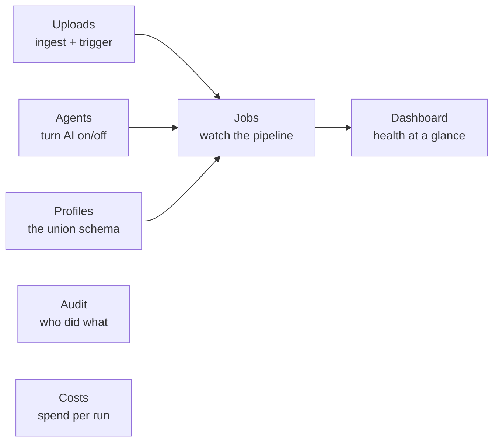

# Admin Console

**Who it's for:** the technical lead and operations. The Admin console is where you **run
the engine** (upload documents, trigger processing, manage AI agents and union profiles,
onboard new unions) and **operate it** (watch jobs, read the audit trail, track cost).

Everything here is read from the **DynamoDB operational read-model**, so the pages load in
fractions of a second and never touch the authoritative rate-sheet data in Aurora.

**Navigation:** `Dashboard · Uploads · Jobs · Agents · Profiles · Audit · Costs`
(plus **Onboard** for a brand-new union).

---

## Dashboard

**What it does.** A single health view: how many sheets are pending review, approved, and
published; recent jobs and their status; throughput and any failures — so an operator
knows the state of the system in one glance.

**How it's built.** Reads the DynamoDB **jobs read-model** (a by-recency index), not the
live Step Functions API. A small writer Lambda listens to Step Functions status changes via
EventBridge and pre-computes each job's stage timeline, so the dashboard is one fast query
instead of many slow calls. *(This is part of the last 48 hours' work — the dashboard went
from seconds to ~0.3s warm.)*

**How to use it.** Land here after sign-in. Click any recent job to open its detail; click a
pending count to jump to the work.

---

## Uploads

**What it does.** The front door for documents. Upload a union's PDFs (CBA, rate notices,
wage sheets) into S3, grouped by union and rate period, then **explicitly** kick off
processing — **nothing reaches the AI or the database until you press "Process this
batch."**

**How to use it.**
1. Choose the union and rate period (or start a new one).
2. Drag in the PDFs — they upload to the inputs bucket in S3.
3. Review the file list; remove anything wrong.
4. Press **Process this batch** → a Step Functions execution starts and appears under
   **Jobs**.

**Why explicit.** Cost and trust: no document is read by Claude or written to the database
on upload alone. You decide when a batch runs.

---

## Jobs

**What it does.** The live list of pipeline runs (Step Functions executions), each with
status — running, succeeded, or failed — union, period, and duration. Open one for the
**stage-by-stage timeline**.

**Job detail (the timeline).** Each run shows its three stages — **Plan → Synthesize →
Publish** — with per-stage status, duration, and a link to that stage's logs, plus the
input documents and the output CSV/Excel artifacts. If a stage fails, the error and the
cause are shown inline so you can see *where* and *why*.

**How it's built.** Same DynamoDB read-model as the dashboard — the writer Lambda captures
each execution's full history once, at the moment it changes state, and stores the timeline
shape the UI needs. *(Rebuilt in the last 48 hours; this is the CQRS read-model that made
Jobs fast and removed the N+1 calls to Step Functions.)*

**How to use it.** Click a job → read the timeline top to bottom. Green stages succeeded;
a red stage shows the failure. Download the artifacts, or open the source PDFs.

---

## Agents

**What it does.** Turns the AI agents **on and off** without a redeploy. The pipeline reads
this configuration before each run — if the extractor agent is disabled, a batch won't call
the model. Used to pause AI processing, or to pin a specific agent image version.

**How to use it.** Flip an agent's toggle; the change takes effect on the next run. The
current image version is shown so you know exactly which build is live.

**Why it matters.** It's an operational kill-switch and a version control for the AI — useful
during a demo, a cost freeze, or a controlled rollout of a new agent build.

---

## Profiles

**What it does.** Shows and edits each union's **profile** — its rate-sheet *structure*
(zones, classifications, fund columns, indenture-cohort rules, overtime multipliers).
**Structure only — never dollar values.** The profile is the AI's target schema and the
oracle the output is validated against.

**How profiles are created.**
- **Learned from the CBA** — the AI reads a union's collective bargaining agreement and
  drafts the profile, mapped to the client's canonical fund and classification names.
- **Auto-built on first upload** — send an unseen union's CBA + notices and the system
  builds its profile *and* produces the rate sheet in the same run.
- **Stored in Aurora, editable here** — adjust a canonical name, a multiplier, or a cohort
  rule and the next run uses it. **No redeploy.**

**How to use it.** Open a union → review its structure → edit a field if the canonical
mapping needs a tweak → save. The change steers every future extraction for that union.

> **This is why the product scales.** Onboarding a union is a data change (its profile),
> not an engineering project. The profile is the backbone the whole system reasons against.

---

## Onboard

**What it does.** Brings a **brand-new union** into the system from its documents alone.
Point it at an unseen union's CBA (and any notices); the system drafts the profile, runs
the pipeline, and produces a first rate sheet for review.

**How to use it.**
1. Create the union, upload its CBA + any rate notices.
2. Run onboarding — the profile is auto-drafted and the first sheet is synthesized.
3. Review the drafted profile under **Profiles**, adjust canonical names if needed.
4. The new rate sheet appears in the Business **Inbox** for review.

**Proven on unseen unions** — including a **130-page** CBA (handled by splitting the
document to fit the model's input limits). Adding a union is a document upload.

---

## Audit

**What it does.** The complete, immutable trail of **who did what, when** — every
extraction, comment, override, AI improvement, review, approval, reject, and publish.
Sourced from Aurora `audit_log`, the legal record.

**How to use it.** Filter by union, period, actor, or action. Every entry ties an action to
a person (or to the AI agent) and a timestamp — this is what you hand an auditor or trustee.

**Why it matters.** This is a benefit-fund product; the numbers govern members' money. The
audit trail is the evidence that every value was extracted, reviewed, and approved
correctly — and that no single person could push rates alone.

---

## Costs

**What it does.** Tracks spend per run and over time — the AI model calls (Bedrock) and the
infrastructure behind each batch — so the cost of producing a rate sheet is visible and
attributable.

**How to use it.** Review cost per job or per union; spot an expensive run (for example a
very large CBA) and correlate it with the **Jobs** timeline.

**How it's built.** Operational telemetry in DynamoDB, alongside jobs — never mixed with the
authoritative rate data.

---

## At a glance — Admin

| Page | Purpose | Backed by |
|---|---|---|
| **Dashboard** | System health in one view | DynamoDB read-model |
| **Uploads** | Ingest PDFs + trigger a batch | S3 + Step Functions |
| **Jobs** | Watch the pipeline, stage by stage | DynamoDB read-model |
| **Agents** | Turn AI on/off, pin versions | DynamoDB agent config |
| **Profiles** | View/edit the union schema | Aurora (profiles) |
| **Onboard** | Add a new union from its CBA | Pipeline + profile drafter |
| **Audit** | Who did what, when | Aurora `audit_log` |
| **Costs** | Spend per run / union | DynamoDB telemetry |

> **The golden rule:** the Admin console *operates* the engine. The authoritative rate
> sheets — and the right to approve and publish them — live in the **Business** console,
> under two-person control.
