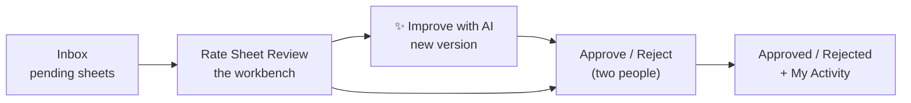
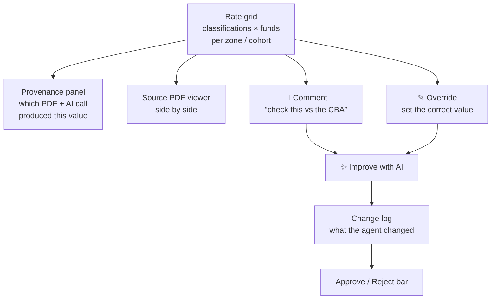

# Business Console

**Who it's for:** the benefits / business lead who owns the numbers. The Business console is
where a rate sheet is **reviewed cell-by-cell, corrected, improved by the AI, and approved**
— under two-person control, with full provenance and a complete audit trail.

This is the heart of the product. Everything here reads and writes **Aurora**, the legal
system of record.

**Navigation:** `Inbox · By Union · Approved · Rejected · Review Queue · My Activity`



---

## Inbox

**What it does.** Your work queue — every rate sheet in `pending review`, newest first, with
its union, period, gap count, and confidence. This is where a freshly extracted sheet (or a
new AI-improved version) lands.

**How to use it.** Open the top item to start reviewing. A gap count above zero tells you the
documents were missing something the reviewer needs to resolve.

---

## By Union

**What it does.** The same sheets organized by **union** rather than by recency — every
union, its periods, and the state of each sheet (pending, approved, published). Use it to
find a specific union's current rate sheet or its history.

**How to use it.** Pick a union → see its periods and versions → open any sheet to review or
to read an approved one.

---

## Review Queue

**What it does.** A focused, prioritized list of what needs human attention — sheets with
low-confidence cells or open gaps surfaced first, so the reviewer spends time where the AI is
least sure.

**How to use it.** Work it top to bottom; each item deep-links into the cell that needs
attention.

---

## Rate Sheet Review — the workbench

This is the core screen. It shows one rate sheet as a grid — **classifications × fund
columns**, per zone and indenture cohort — alongside the source PDF, with everything a
reviewer needs to trust or correct each value.



**What you can see and do on each cell:**

- **Provenance** — open any value to see *exactly* which source PDF(s) and which AI call
  produced it. Nothing is unexplained.
- **Source PDF, side by side** — read the underlying document without leaving the screen.
- **💬 Comment** — flag a cell that looks wrong ("this should follow Article 6"). Press
  **Save**; it's recorded in Aurora as an open correction.
- **✎ Override** — set the correct value yourself when you know it. Press **Save**; it's
  recorded with who/when/why. Overrides are human-attributed and authoritative.

Comments and overrides accumulate as **open corrections** on the sheet. You can leave any
combination of both, across any number of cells, then act on them all at once.

---

## ✨ Improve with AI — the agentic loop *(new, last 48 hours)*

This is the product's differentiator. After you've left comments and overrides, press
**✨ Improve with AI**. The **ImproverAgent** (a long-running agent on Bedrock AgentCore)
takes *all* your open corrections and produces a **new version** of the sheet — it never
edits the one you're looking at.

**What the agent does, deterministically and transparently:**

1. **Overrides** → applied verbatim, and every **derived/overtime column is recomputed in
   code** so the whole sheet stays internally consistent (no stale totals).
2. **Comments** → only the commented cell is sent back to **Claude on Bedrock**, which
   **re-reads the source PDFs**. If the source confirms a value, it's updated and the
   citation recorded. **If the source can't confirm it, the prior value is kept** and
   flagged — the agent never invents a number to satisfy a comment.
3. The output is a **new version (v+1)**, written to Aurora in `pending review`, with a full
   change log. **A human still approves it** — the AI proposes, a person disposes.

**How to use it.**
1. Leave your comments / overrides and **Save** each.
2. Press **✨ Improve with AI**. It runs **asynchronously** (re-synthesis takes minutes) — the
   button shows progress, then automatically switches you to the new version.
3. Review the **change log** (below), then approve or reject as usual.

### The change log — "what the agent changed"

On an improved version, a dedicated panel lists **every cell the agent touched**, so a human
can verify before approving:

| Column | What it shows |
|---|---|
| **Cell** | The package + fund column that changed |
| **Change** | `prior value → new value` |
| **Source** | How it was produced — *human override*, *recomputed*, *re-synthesized*, or *profile fix* |
| **Why (provenance)** | The reason or the cited passage (e.g. "Article 6 Section 14"), with a confidence |

Because the AI now *acts* on corrections — not just stores them — this panel is the audit
guarantee: every changed value is attributable either to a person or to a cited passage in
the source documents. Nothing changes silently.

> **Versioned, never destructive.** v1 (the original) stays intact and viewable; the
> improvement is v2. You can diff them and see exactly what the reviewer and the AI changed,
> and why. This lineage is what makes the result defensible.

---

## Approve / Reject — two-person control

**What it does.** Moves a sheet through its lifecycle under **maker-checker dual control**,
enforced in the database:

```
pending review → Mark Reviewed (reviewer) → Approve (a DIFFERENT person) → Published
                                          ↘ Reject (with a reason)
```

- **Mark Reviewed** — a reviewer attests they've checked the sheet.
- **Approve** — a *second, different* person approves. **Self-approval is blocked** — the
  same person cannot both review and approve.
- **Reject** — send it back with a reason; it's recorded and the sheet returns for rework.

**Why it matters.** No single person can push rates to production. Every transition is
audited. This is the control a benefit fund requires.

---

## Approved · Rejected · My Activity

- **Approved** — every sheet that cleared review and approval, with its approver and date;
  the published CSV/Excel are downloadable here.
- **Rejected** — sheets sent back, with the reason and who rejected them — so nothing is
  lost and rework is traceable.
- **My Activity** — your own trail: the comments, overrides, reviews, approvals, and
  rejections *you* made. Personal accountability, at a glance.

---

## The trust model, from the reviewer's seat

- **Nothing is invented** — every value is from the source PDFs or a human override; gaps
  are flagged with the document needed to fill them.
- **The AI shows its work** — every improvement records what changed, from where, and with
  what confidence.
- **Two people, always** — review and approval are separate people; the database enforces
  it.
- **Everything is recorded** — comment, override, improvement, review, approval, publish —
  all in Aurora, all auditable.

> **Validated against the client's own sheets.** The engine's output is checked
> cell-by-cell against the client's real rate sheets — including the hardest case
> (Sprinkler 281, with two indenture cohorts split from a single apprentice wage sheet,
> row-for-row exact). Anything the documents genuinely don't contain is flagged, not
> guessed.
